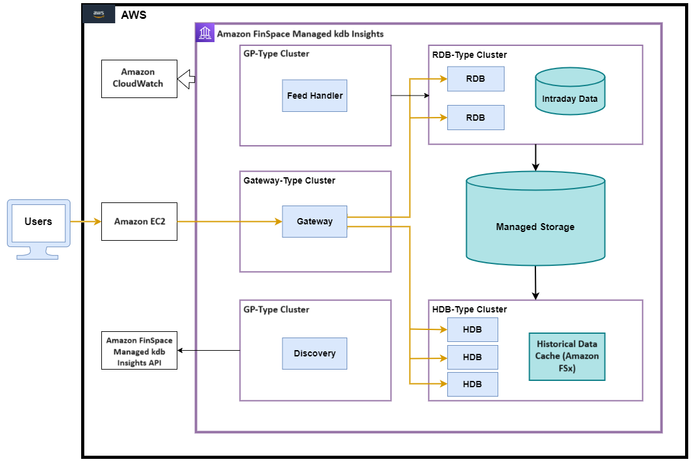

TorQ with Managed kdb Insights
===============

When porting TorQ to AWS we chose to make a minimum viable product and then build out features on top of this to give clients a working AWS solution that includes the essential TorQ features. We intend to align with the Managed kdb Insights roadmap, adding additional functionality to the TorQ implementation as new features become available. The processes available in our first iteration of TorQ for Amazon FinSpace with Managed kdb Insights are the following:

- Discovery: Processes use the discovery service to register their own availability, find other processes (by process type), and subscribe to receive updates for new process availability (by process type). The discovery service does not manage connections - it simply returns tables of registered processes, irrespective of their current availability. It is up to each individual process to manage its own connections.

- Historical Database: The HDB holds data from before the current period. It is read only and used for querying all historical data. Data is stored in partitions and can be queried through the gateway process.

- Real-time Database: The RDB subscribes and captures all data from the feed handler throughout the current period and store it in memory for query or real-time processing.

- Feed Handler: The feed handler acts as a preparation stage for the data, transforming the data into kdb+ format and writing it to our RDB.

- Gateway: The gateway acts as a single interface point that separates the end user from the configuration of underlying databases. You don't need to know where data is stored, and you don't need to make multiple requests to retrieve it. It can access a single process, or join data across multiple processes. It also does load balancing and implements a level of resilience by hiding back-end process failure from clients.

These features allow us to store real-time and historical data and make it available to users.

## Notable Differences within this reduced version of TorQ in comparison to normal TorQ

### env.q

The entry point script is ``env.q`` which sets initial environment variables and loads the main ``torq.q`` script. This is used because Managed kdb Insights does not allow setting environment variables or running shell scripts at startup. The “env.q” file is the first of our files loaded in and it then specifies based on start-up parameters what to load in next. It also references and connects to the setup created inside Managed kdb Insights . For example, the database name for your AWS environment is referenced inside of this file.

### Loading code/hdbs

Generally the main process code file (e.g. ``code/processes/discovery.q``) is passed as a command line parameter with the ``-load`` flag. We can't do this in Managed kdb Insights as filepaths are not allowed as command line parameters (yet). To work around this, we include a ``.proc.params[`load]`` variable in the settings file. We use the same approach for loading data directories into HDBs.