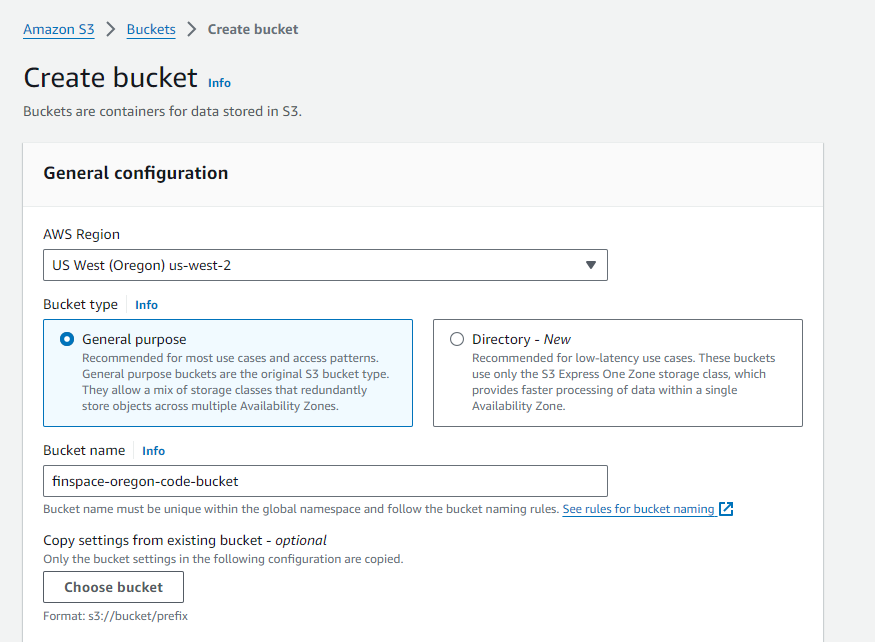
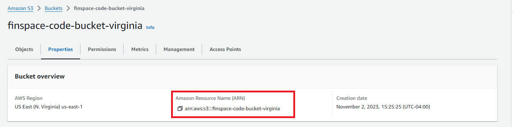

Prerequisites
===============

- An [AWS account with an AdministratorAccess policy](https://docs.aws.amazon.com/aws-managed-policy/latest/reference/AdministratorAccess.html) to create the Managed kdb resources.
- A KX insights license applied to your account. If you don’t have one see [Activate your Managed kdb Insights license - Amazon FinSpace](https://docs.aws.amazon.com/finspace/latest/userguide/kdb-licensing.html).
- Inside a Linux system you will need to download code from the [TorQ](https://github.com/DataIntellectTech/TorQ/tree/master) and [TorQ-Amazon-FinSpace-Starter-Pack](https://github.com/DataIntellectTech/TorQ-Amazon-FinSpace-Starter-Pack/tree/master) GitHub repositories - Instructions below.
- If you are **NOT** using our Terraform deployment option to create and set up your Kdb Environment, follow [this AWS workshop](https://catalog.us-east-1.prod.workshops.aws/workshops/a1575309-1f43-4945-a5fa-a4d62d5e821d/en-US/envcreate) to do so.

## Downloading the Code

### TorQ

Take note of the latest version of code from the [TorQ Latest Release Page](https://github.com/DataIntellectTech/TorQ/releases/latest) - release name are v#.#.# e.g. v1.0.0

Run the following code - ensure you replace `<copied_version_name>` with the release version you took note of above.

    git clone --depth 1 --branch <copied_version_name> https://github.com/DataIntellectTech/TorQ.git

### TorQ Amazon FinSpace Starter Pack

Take note of the latest version of code from the [TorQ-Amazon-FinSpace-Starter-Pack Latest Release Page](https://github.com/DataIntellectTech/TorQ-Amazon-FinSpace-Starter-Pack/releases/latest) - release name are v#.#.# e.g. v1.0.0

Run the following code - ensure you replace `<copied_version_name>` with the release version you took note of above.

    git clone --depth 1 --branch <copied_version_name> https://github.com/DataIntellectTech/TorQ-Amazon-FinSpace-Starter-Pack.git

### Zip them up together

Now we will zip these files together:

    zip -r code.zip TorQ/ TorQ-Amazon-FinSpace-Starter-Pack/ -x "TorQ*/.git*"

## Create and Upload code to S3 (For Non Terraform Deployment Only)

**Two S3 buckets are required for this setup** - one for the code and one for the data.

Create your S3 bucket by searching for "S3" and clicking `Create bucket`

Choose the same AWS Region as your AWS Finspace KxEnvirnment

Give your bucket a name

<p style="text-align: center">
    
</p>

Unselect the `Block all public access` box

<p style="text-align: center">
    
</p>

Leave all other settings as the default

### Edit the access policy

Copy the ARN of your S3 buckets in the console by navigating to your S3 bucket, selecting `Properties`

<p style="text-align: center">
    
</p>

Edit the Access policy of both S3 buckets with the JSON document:

```
{
    "Version": "2012-10-17",
    "Id": "FinSpaceServiceAccess",
    "Statement": [{
            "Effect": "Allow",
            "Principal": {
                "Service": "finspace.amazonaws.com"
            },
            "Action": [
                "s3:GetObject",
                "s3:GetObjectTagging",
                "s3:GetObjectVersion"
            ],
            "Resource": "<ARN OF BUCKET COPIED EARLIER>/*",
            "Condition": {
                "StringEquals": {
                    "aws:SourceAccount": "766012286003"
                }
            }
        },
        {
            "Effect": "Allow",
            "Principal": {
                "Service": "finspace.amazonaws.com"
            },
            "Action": "s3:ListBucket",
            "Resource": "<ARN OF BUCKET COPIED EARLIER>",
            "Condition": {
                "StringEquals": {
                    "aws:SourceAccount": "766012286003"
                }
            }
        }
    ]
 }
```

### Upload code to S3 code bucket

Upload the zip file created earlier to AWS S3 codebucket:

    aws s3 cp code.zip s3://<your S3 codebucket name>

### Upload hdb to S3 data bucket 

Copy the pre-packaged hdb to AWS S3 databucket:

    aws s3 cp --recursive TorQ-Amazon-FinSpace-Starter-Pack/hdb s3://<your S3 data bucket name>/hdb