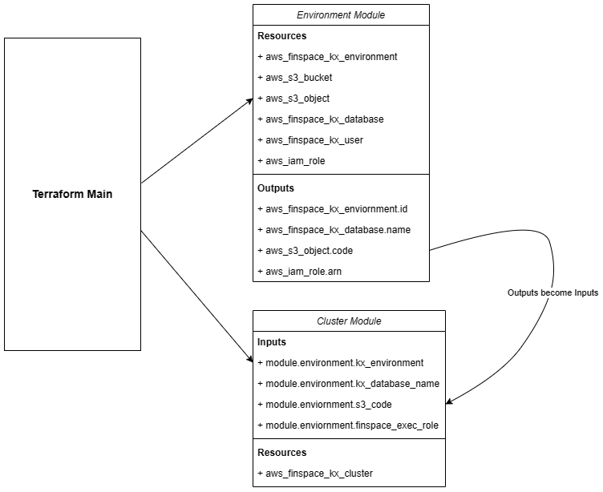

Terraform
===============

The process of setting up a working Managed kdb environment manually can take some time - especially if you are new to AWS. To aid this process we have a Terraform deployment option which should allow you to boot TorQ in Managed kdb Insights in a few simple commands. 

This Terraform script can be used to deploy an entire environment from scratch. This will include:

- Creating and uploading data to S3 buckets with required policies

- Creating IAM roles

- Creating network and transit gateway

- Deploying clusters

It is split into two modules, one for the environment and one for the clusters. This makes the directory more organised and cluster deployments easier to manage. The cluster module is still dependent on the environment module as it will import some variables from here that are needed for cluster creation.



This Terraform setup is designed to deploy and manage a Managed kdb Insights environment running a TorQ bundle.

## Prerequisites

1. Ensure you have followed the [standard prerequisite steps](https://dataintellecttech.github.io/TorQ-Amazon-FinSpace-Starter-Pack/04-prerequisites/) to ensure you have the latest versions of code.
2. Have the [latest version of the AWS CLI installed](https://docs.aws.amazon.com/cli/latest/userguide/getting-started-install.html).
3. Have the [latest version of Terraform installed](https://developer.hashicorp.com/terraform/tutorials/aws-get-started/install-cli).
4. [Configure the AWS CLI to your AWS account](https://docs.aws.amazon.com/signin/latest/userguide/command-line-sign-in.html).
5. Create a KMS key in the region where you intend to set up your environment. You will also need to edit the key policy to grant FinSpace permissions.
6. Note that FinSpace environments are limited to one per region. Make sure you don't already have an environment set up in the same region.
7. This instruction refers to Linux and would only work under the Linux environment.

## Resource Link
* For detailed Terraform deployment instructions, refer to [TorQ in Finspace Deployment / Terraform](https://data-intellect.atlassian.net/wiki/spaces/TK/pages/238944400/FinTorq+Deployment+Terraform).

## How to Use - Initial Deployment

New user please continue and follow this section - Users with existing infrastructure, please skip to our [existing infrastructure section](#how-to-use---deploying-with-terraform-for-users-with-existing-infrastructure).

1. (Optional) If you have an HDB you want to migrate to FinSpace, replace the dummy HDB in `TorQ-Amazon-FinSpace-Starter-Pack/inthdb/hdb` or `TorQ-Amazon-FinSpace-Starter-Pack/datehdb/hdb`
2. Move into the `TorQ-Amazon-FinSpace-Starter-Pack/terraform-deployment/deployments` directory; within there should be two sub-directories : `date-par` and `int-par`. 
  If you want your finspace with Managed Kdb Insights system to use date partitions use `date-par`
  If you want your system to perform multiple intra-day writedowns with int partitions use `int-par`
  `cd` into one of the two sub-directories. This will be your Terraform working directory from which you should run all `terraform` commands.
  (Note: All writedowns in Finspace with Managed Kdb Insights will be done through [changesets](https://docs.aws.amazon.com/finspace/latest/userguide/creating-changeset-in-a-dataset.html))
3. (Optional) symlink your hdb and your zipped source code to your working directory
4. Modify variables inside the `terraform.tfvars` file, such as region name, environment name, database name. You can modify it by replacing the variable name inside of `"Name"`. For example, For the variable on `role-name`, you can change the variable name by replacing `"finspace-role"`.
5. (Optional) If you have changed the database name from the default `finspace-database` to any other names, please also edit the `env.q` file, changing the database name to the new variable that you have set in line 19.
6. Run `aws configure` in the terminal to set up your access key and secret key from your AWS account. This is needed to connect to your account and use the Terraform deployment. Check our resource link for more instructions on how to find your access key and secret key [Prerequisites](#prerequisites).
7. From your Terraform working directory which is `TorQ-Amazon-FinSpace-Starter-Pack/terraform-deployment/deployments/date-par|int-par`, run `terraform init`.
8. If initialized without error, run `terraform plan`. This will show all resources set to be created or destroyed by Terraform.
9. Run `terraform apply` to execute this plan. The initial deployment can take approximately 45 minutes, and connection losses can cause errors with deployment, so it's a good idea to run this in `nohup`. (Using `nohup` might lead to a higher cost of operating the codes if you are using Terraform from a cloud environment.) Example nohup run: `nohup terraform apply -auto-approve > terraform_apply.log 2>&1 &`. 

You can now skip ahead to our [Managing Your Infrastructure section](#managing-your-infrastructure)

## How to Use - Deploying With Terraform For Users With Existing Infrastructure

For users with existing infrastructure in their AWS account who would like to reuse the same resources for their TorQ in Finspace bundle, you can use import blocks in Terraform. This functionality allows you to import existing infrastructure resources into Terraform, bringing them under Terraform's management. The import block records that Terraform imported the resource and did not create it. After importing, you can optionally remove import blocks from your configuration or leave them as a record of the resource's origin.

Once imported, Terraform tracks the resource in your state file. You can then manage the imported resource like any other, updating its attributes and destroying it as part of a standard resource lifecycle.

Move into the `deployments` directory, and you'll see an `imports.tf` file (currently empty). This `imports.tf` file is automatically run before Terraform applies any changes to the structure, importing existing structures from your AWS to the deployment system.

### Terraform Import Block Syntax

```
import {
  to = aws_instance.example
  id = "i-abcd1234"
}

resource "aws_instance" "example" {
  name = "hashi"
  # (other resource arguments...)
}
```
The above `import` block defines an import of the AWS instance with the ID "i-abcd1234" into the `aws_instance.example` resource in the root module.

The import block has the following arguments:

| Argument | Description | Example |
| ----------- | ----------- | ----------- |
| `to` | The instance address this resource will have in your state file. | `to = aws_instance.example` |
| resourse (e.g. `id` or `name`) | A string with the import information of the resource. | Example 1. `id = "i-abcd1234"`<br> Example 2. `name = "aws/vendedlogs/finspace/myclustername"` |
| `provider` (optional) | An optional custom resource provider.<br> If you do not set the provider argument, Terraform attempts to import from the default provider. | See [The Resource provider Meta-Argument](https://developer.hashicorp.com/terraform/language/meta-arguments/resource-provider) for details. |

The import block's ID/name argument can be a literal string of your resource's import ID, or an expression that evaluates to a string. Terraform needs this detail to locate the resource you want to import.

The import ID/name must be known at plan time for planning to succeed. If the value of `id`/`name` is only known after apply, `terraform plan` will fail with an error.

The identifier you use for a resource's import ID/name is resource-specific. You can find the required ID/name in the [provider documentation](https://registry.terraform.io/providers/hashicorp/aws/latest) for the resource you wish to import.

### Terraform import block Template
We have created a Terraform import block template in `terraform-deployment/importtemplate.md`. In this template, you can select the needed import block and paste it into the `imports.tf` file within the `terraform-deployment/deployments/imports.tf` directory. Remember to change the ID to the referring ID of your existing infrastructure.

## Managing Your Infrastructure

Once your environment is up and running, you can use this configuration to manage it:

1. Code Updates: If you make any code changes in `TorQ` or `TorQ-Amazon-FinSpace-Starter-Pack` and want to apply these to your clusters, rezip these directories and run the Terraform deployment again. This will recreate clusters with the updated code.
2. Cluster Config: If you want to make changes to a cluster's config settings (e.g., node size of the RDB), update this in `clusters/rdb.tf` and run Terraform again. The RDB will be recreated with the new node size.
3. Delete/Create Clusters: Clusters can be deleted or created individually or all at once from the `terraform.tfvars` file. To delete a cluster, set its count to 0. To delete all clusters, set `create-clusters` to 0.
4. (**int-par deployment only**) log groups and metric filters: These resources are only created if the dependent log groups exists so by default are ignored. Once your kxenvironment is up, set `create-mfilters` flag to 'true' and update the `wdb_log_groups` variable in `terraform.tfvars` to include the log groups of your clusters you wish to monitor. Then rerun `terraform apply`

### Basic Commands in Terraform 
*  `terraform init`       -   Prepare your working directory for other commands
*  `terraform validate`   -   Check whether the configuration is valid
*  `terraform plan`       -   Show changes required by the current configuration
*  `terraform apply`      -   Create or update infrastructure
*  `terraform destroy`    -   Destroy previously-created infrastructure
* For more commands in Terraform, please visit [Terraform Command](https://developer.hashicorp.com/terraform/cli/commands) 

### Terraform State Management

Terraform maintains a state file that tracks the state of the deployed infrastructure. This state file is crucial for Terraform to understand what resources have been created and to make changes to them. To ensure proper state management:

- Always store your state files securely, as they may contain sensitive information.
- Consider using remote state storage, such as Amazon S3, to keep your state files safe and accessible from multiple locations.
- Avoid manual changes to resources managed by Terraform, as this can lead to inconsistencies between the actual infrastructure and Terraform's state.

## List of AWS Structures that will be created with our Terraform deployment
* module.environment.data.aws_iam_policy_document.iam-policy
* module.environment.data.aws_iam_policy_document.s3-code-policy
* module.environment.data.aws_iam_policy_document.s3-data-policy
* module.environment.aws_ec2_transit_gateway.test
* module.environment.aws_finspace_kx_database.database
* module.environment.aws_finspace_kx_environment.environment
* module.environment.aws_finspace_kx_user.finspace-user
* module.environment.aws_iam_policy.finspace-policy
* module.environment.aws_iam_role.finspace-test-role
* module.environment.aws_iam_role_policy_attachment.policy_attachment
* module.environment.aws_s3_bucket.finspace-code-bucket
* module.environment.aws_s3_bucket.finspace-data-bucket
* module.environment.aws_s3_bucket_policy.code-policy
* module.environment.aws_s3_bucket_policy.data-policy
* module.environment.aws_s3_bucket_public_access_block.code_bucket
* module.environment.aws_s3_bucket_public_access_block.data_bucket
* module.environment.aws_s3_bucket_versioning.versioning
* module.environment.null_resource.create_changeset
* module.environment.null_resource.upload_hdb
* module.lambda.data.archive_file.lambda_my_function
* module.lambda.data.aws_iam_policy_document.assume_events_doc
* module.lambda.data.aws_iam_policy_document.assume_lambda_doc
* module.lambda.data.aws_iam_policy_document.assume_states_doc
* module.lambda.data.aws_iam_policy_document.ec2-permissions-lambda
* module.lambda.data.aws_iam_policy_document.eventBridge_policy_doc
* module.lambda.data.aws_iam_policy_document.finspace-extra
* module.lambda.data.aws_iam_policy_document.lambda_basic_execution
* module.lambda.data.aws_iam_policy_document.lambda_error_queue_access_policy_doc
* module.lambda.data.aws_iam_policy_document.lambda_invoke_scoped_access_policy_doc
* module.lambda.data.aws_iam_policy_document.sns_publish_scoped_access_policy_doc
* module.lambda.data.aws_iam_policy_document.xray_scoped_access_policy_doc
* module.lambda.aws_cloudwatch_event_rule.rotateRDB_eventRule
* module.lambda.aws_cloudwatch_event_rule.rotateWDB_eventRule
* module.lambda.aws_cloudwatch_event_target.onRotateRDB_target
* module.lambda.aws_cloudwatch_event_target.onRotateWDB_target
* module.lambda.aws_iam_policy.eventBridge_policy
* module.lambda.aws_iam_policy.lambda_basic_policy
* module.lambda.aws_iam_policy.lambda_ec2_policy
* module.lambda.aws_iam_policy.lambda_finspace_policy
* module.lambda.aws_iam_policy.lambda_invoke_scoped_access_policy
* module.lambda.aws_iam_policy.sns_publish_scoped_access_policy
* module.lambda.aws_iam_policy.xray_scoped_access_policy
* module.lambda.aws_iam_role.eventBridge_role
* module.lambda.aws_iam_role.lambda_errorFormat_execution_role
* module.lambda.aws_iam_role.lambda_execution_role
* module.lambda.aws_iam_role.lambda_onConflict_execution_role
* module.lambda.aws_iam_role.states_execution_role
* module.lambda.aws_iam_role_policy_attachment.attach1
* module.lambda.aws_iam_role_policy_attachment.attach2
* module.lambda.aws_iam_role_policy_attachment.attach3
* module.lambda.aws_iam_role_policy_attachment.attach_basic_to_errorFormat
* module.lambda.aws_iam_role_policy_attachment.attach_basic_to_onConflict
* module.lambda.aws_iam_role_policy_attachment.attach_ec2_policy_to_onConflict
* module.lambda.aws_iam_role_policy_attachment.attach_eventBridge_policy
* module.lambda.aws_iam_role_policy_attachment.attach_finspace_policy_to_onConflict
* module.lambda.aws_iam_role_policy_attachment.attach_lambda_invoke_scoped_access_policy
* module.lambda.aws_iam_role_policy_attachment.attach_sns_publish_scoped_access_policy
* module.lambda.aws_iam_role_policy_attachment.attach_xray_scoped_access_policy
* module.lambda.aws_lambda_function.finSpace-rdb-errorFormat-lambda
* module.lambda.aws_lambda_function.finSpace-rdb-lambda
* module.lambda.aws_lambda_function.finSpace-rdb-onConflict-lambda
* module.lambda.aws_sfn_state_machine.sfn_state_machine
* module.lambda.aws_sns_topic.lambda_error_topic
* module.lambda.aws_sns_topic_subscription.lambda_error_email_target[0]
* module.lambda.aws_sns_topic_subscription.lambda_error_queue_target
* module.lambda.aws_sqs_queue.lambda_error_queue
* module.lambda.aws_sqs_queue_policy.lambda_error_queue_access_policy
* module.lambda.local_file.lambda_configs
* module.metricfilter.data.aws_cloudwatch_log_group.wdb_log_groups["*"]
* module.metricfilter.aws_cloudwatch_event_rule.wdb_log_monit_rule[0]
* module.metricfilter.aws_cloudwatch_event_target.wdb_log_monit_rule_target[0]
* module.metricfilter.aws_cloudwatch_log_metric_filter.wdb_log_monit["*"]
* module.metricfilter.aws_cloudwatch_metric_alarm.wdb_log_monit_alarm[0]
* module.network.aws_internet_gateway.finspace-igw
* module.network.aws_route.finspace-route
* module.network.aws_route_table.finspace-route-table
* module.network.aws_security_group.finspace-security-group
* module.network.aws_subnet.finspace-subnets[0]
* module.network.aws_subnet.finspace-subnets[1]
* module.network.aws_subnet.finspace-subnets[2]
* module.network.aws_subnet.finspace-subnets[3]
* module.network.aws_vpc.finspace-vpc

### Destorying your infastructure

Normally, you should be able to take down your entire stack by running `terraform destroy`. There are some known limitations in this terraform stack, and a few manual steps are involved:
1. Delete any clusters that have been created manually or by any lambdas. On the console navigate to your kx environment, select the 'Clusters' tab, and delete each cluster by selecting the cluster and clicking 'Delete'.
2. manually delete your hdb. This is because the hdb files are deployed using "local-exec" but not managed by terraform istelf. To do this run : `aws s3 rm --region "<region>" --recursive s3://<your bucket name>/hdb/`.
3. Run `terraform destroy`
4. Sometimes terraform does not report if the transit gateway has been destroyed. Navigate to VPC > Transit Gateways on the AWS console, and delete any outstanding transit gateways associated with your kx environment (you may need to delete any transit gateway attachments before deleting the transit gateway itself)

## References and Documentation

For more in-depth information and documentation, explore the following resources:

- [Terraform Documentation](https://learn.hashicorp.com/tutorials/terraform/)
- [AWS Documentation](https://docs.aws.amazon.com/)

These resources provide detailed information about Terraform and AWS services, best practices, and advanced configurations.
