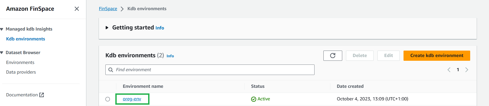
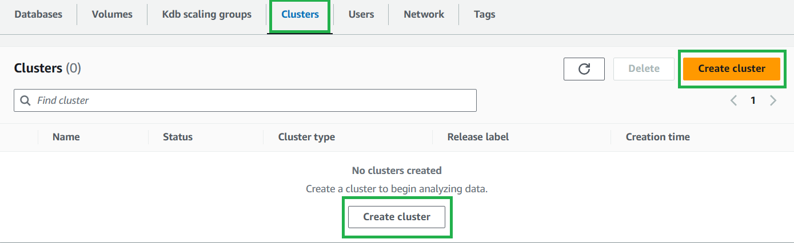
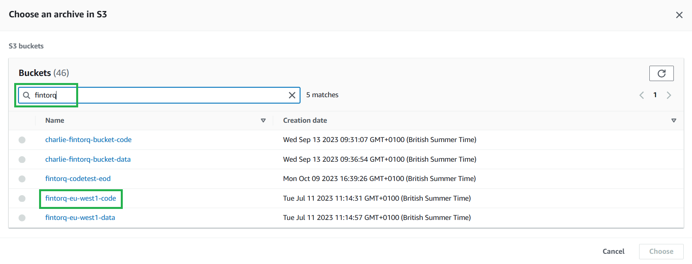
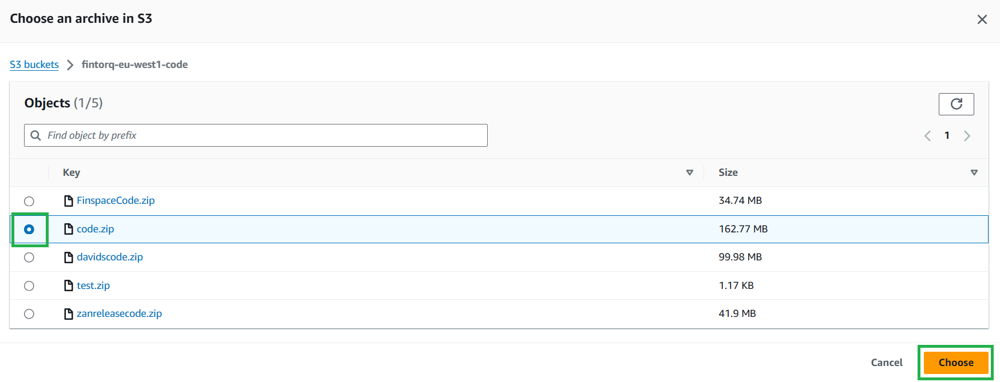
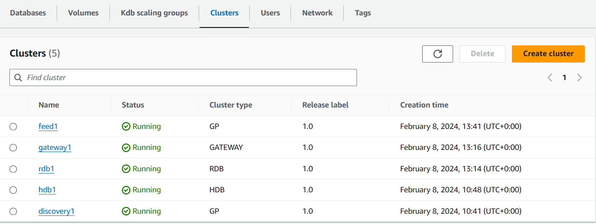
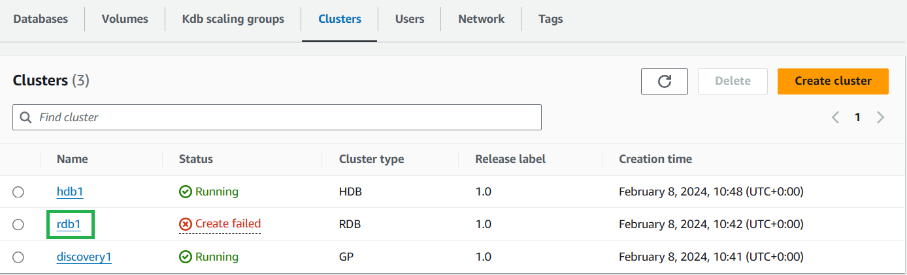
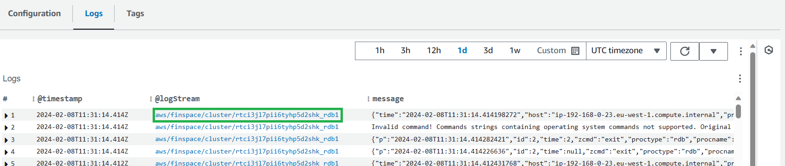

Creating TorQ Clusters
===============

To create a cluster, firstly select your kdb environment:

Then select the “Clusters” tab, and either of the “Create Cluster” buttons:

## Discovery Cluster

1. Set the cluster type to “General Purpose”, also known as "GP".

2. Choose a name for your cluster.
    - Note, this name must match your process name, ``procname``, added during the next stage of cluster creation - This is due to process connections requiring the cluster name, which is not visible from within the process, but procname is.
    - Our suggestion is to use the process type, ``proctype``, with a number. e.g. ``discovery1``.

3. Select the execution role for the [IAM user previously created](https://catalog.us-east-1.prod.workshops.aws/workshops/a1575309-1f43-4945-a5fa-a4d62d5e821d/en-US/rolesetup). The user for all 5 clusters should be the same. This is so that each cluster has the correct permissions.

    

4. Select "Run as a dedicated cluster" for Cluster running option.
    - For the MVP this is the most appropriate option. For customising later, see [this page](https://docs.aws.amazon.com/finspace/latest/userguide/create-scaling-groups.html) for more details on kdb scaling groups.

5. Select an Availablilty Zone, make sure it includes your [previous created subnet](https://docs.aws.amazon.com/vpc/latest/userguide/create-subnets.html).

    

6. Select your node size. For this MVP we are going to select the smallest.

7. Leave Tags as empty and select next to go to the next page.

    

8. Select "Browse S3", search and select your codebucket and select your code.zip file.
    - alternatively, you can copy the URL from the codebucket itself.

    
    

9. Enter ``TorQ-Amazon-FinSpace-Starter-Pack/env.q`` as your initialization script.

10. Select "Add command-line arguments" twice and enter the keys and values in the below table:

    | Key | Value |
    | ----------- | ----------- |
    | proctype | discovery |
    | procname | discovery1 |

This specified initialization script and the command line arguments will set up the necessary environment for your cluster.

11. Select next to go to the next page.

12. Select your previously created [VPC ID](https://docs.aws.amazon.com/vpc/latest/userguide/create-vpc.html), [Subnets](https://docs.aws.amazon.com/vpc/latest/userguide/create-subnets.html), and Security Groups (we can use the readilty available default), then select next to go to the next page.

13. Leave everything as blank and move on to the next page.

14. Check the entered information in the review page, then select "create cluster".

## Real-Time Database (RDB) Cluster

1. Set the cluster type to “RDB".

2. Choose a name for your cluster.
    - Note, this name must match your process name, ``procname``, added during the next stage of cluster creation - This is due to process connections requiring the cluster name, which is not visible from within the process, but procname is.
    - Our suggestion is to use the process type, ``proctype``, with a number. e.g. ``rdb1``.

    

3. Select the execution role for the [IAM user previously created](https://catalog.us-east-1.prod.workshops.aws/workshops/a1575309-1f43-4945-a5fa-a4d62d5e821d/en-US/rolesetup). The user for all 5 clusters should be the same. This is so that each cluster has the correct permissions.

4. Select "Run as a dedicated cluster" for Cluster running option.
    - For the MVP this is the most appropriate option. For customising later, see [this page](https://docs.aws.amazon.com/finspace/latest/userguide/create-scaling-groups.html) for more details on kdb scaling groups.

5. Select an Availablilty Zone, make sure it includes your [previous created subnet](https://docs.aws.amazon.com/vpc/latest/userguide/create-subnets.html).

6. Enter a node count of "1". This will be the number of instances in a cluster. For the MVP only 1 is needed.

7. Select your node size. For this MVP we are going to select the smallest.

8. Leave Tags as empty and select next to go to the next page.

    

9. Select "Browse S3", search and select your codebucket and select your code.zip file.
    - alternatively, you can copy the URL from the codebucket itself.

10. Enter ``TorQ-Amazon-FinSpace-Starter-Pack/env.q`` as your initialization script.

11. Select "Add command-line arguments" twice and enter the keys and values in the below table:

    | Key | Value |
    | ----------- | ----------- |
    | proctype | rdb |
    | procname | rdb1 |

This specified initialization script and the command line arguments will set up the necessary environment for your cluster.

12. Select next to go to the next page.

13. Select your previously created [VPC ID](https://docs.aws.amazon.com/vpc/latest/userguide/create-vpc.html), [Subnets](https://docs.aws.amazon.com/vpc/latest/userguide/create-subnets.html), and Security Groups (we can use the readilty available default), then select next to go to the next page.

14. Select your "Database name" from the dropdown menu in the "Savedown database configuration" section.

15. Select ``SDS01`` from the "Savedown volume type" dropdown menu.

16. Enter an amount (in GiB) of required "Savedown volume". ``10`` for this MVP.

17. Select next to go to the next page.

    

18. Check the entered information in the review page, then select "create cluster".

## Historical Database (HDB) Cluster

1. Set the cluster type to "HDB".

2. Choose a name for your cluster.
    - Note, this name must match your process name, ``procname``, added during the next stage of cluster creation - This is due to process connections requiring the cluster name, which is not visible from within the process, but procname is.
    - Our suggestion is to use the process type, ``proctype``, with a number. e.g. ``hdb1``.

    

3. Select the execution role for the [IAM user previously created](https://catalog.us-east-1.prod.workshops.aws/workshops/a1575309-1f43-4945-a5fa-a4d62d5e821d/en-US/rolesetup). The user for all 5 clusters should be the same. This is so that each cluster has the correct permissions.

4. Select "Run as a dedicated cluster" for Cluster running option.
    - For the MVP this is the most appropriate option. For customising later, see [this page](https://docs.aws.amazon.com/finspace/latest/userguide/create-scaling-groups.html) for more details on kdb scaling groups.

5. Select an Availablilty Zone, make sure it includes your [previous created subnet](https://docs.aws.amazon.com/vpc/latest/userguide/create-subnets.html).

6. Enter a node count of "1". This will be the number of instances in a cluster. For the MVP only 1 is needed.

7. Select your node size. For this MVP we are going to select the smallest.

8. Leave Auto-scaling and Tags as empty and select next to go to the next page.

9. Select "Browse S3", search and select your codebucket and select your code.zip file.
    - alternatively, you can copy the URL from the codebucket itself.

10. Enter ``TorQ-Amazon-FinSpace-Starter-Pack/env.q`` as your initialization script.

11. Select "Add command-line arguments" twice and enter the keys and values in the below table:

    | Key | Value |
    | ----------- | ----------- |
    | proctype | hdb |
    | procname | hdb1 |

This specified initialization script and the command line arguments will set up the necessary environment for your cluster.

12. Select next to go to the next page.

13. Select your previously created [VPC ID](https://docs.aws.amazon.com/vpc/latest/userguide/create-vpc.html), [Subnets](https://docs.aws.amazon.com/vpc/latest/userguide/create-subnets.html), and Security Groups (we can use the readilty available default), then select next to go to the next page.

14. For "Database name" select your database from the dropdown menu. Changeset will autoselect at this point.

15. Select "No caching".

16. Select next to go to the next page.

    

17. Check the entered information in the review page, then select "create cluster".

## Gateway Cluster

Ensure that the Discovery cluster is in a "Running" state before creating the Gateway cluster.

1. Set the cluster type to “Gateway".

2. Choose a name for your cluster.
    - Note, this name must match your process name, ``procname``, added during the next stage of cluster creation - This is due to process connections requiring the cluster name, which is not visible from within the process, but procname is.
    - Our suggestion is to use the process type, ``proctype``, with a number. e.g. ``gateway1``.

    

3. Select the execution role for the [IAM user previously created](https://catalog.us-east-1.prod.workshops.aws/workshops/a1575309-1f43-4945-a5fa-a4d62d5e821d/en-US/rolesetup). The user for all 5 clusters should be the same. This is so that each cluster has the correct permissions.

4. Select "Run as a dedicated cluster" for Cluster running option.
    - For the MVP this is the most appropriate option. For customising later, see [this page](https://docs.aws.amazon.com/finspace/latest/userguide/create-scaling-groups.html) for more details on kdb scaling groups.

5. Select an Availablilty Zone, make sure it includes your [previous created subnet](https://docs.aws.amazon.com/vpc/latest/userguide/create-subnets.html).

6. Enter a node count of "1". This will be the number of instances in a cluster. For the MVP only 1 is needed.

7. Select your node size. For this MVP we are going to select the smallest.

8. Leave Tags as empty and select next to go to the next page.

9. Select "Browse S3", search and select your codebucket and select your code.zip file.
    - alternatively, you can copy the URL from the codebucket itself.

10. Enter ``TorQ-Amazon-FinSpace-Starter-Pack/env.q`` as your initialization script.

11. Select "Add command-line arguments" twice and enter the keys and values in the below table:

    | Key | Value |
    | ----------- | ----------- |
    | proctype | gateway |
    | procname | gateway1 |

This specified initialization script and the command line arguments will set up the necessary environment for your cluster.

12. Select next to go to the next page.

13. Select your previously created [VPC ID](https://docs.aws.amazon.com/vpc/latest/userguide/create-vpc.html), [Subnets](https://docs.aws.amazon.com/vpc/latest/userguide/create-subnets.html), and Security Groups (we can use the readilty available default), then select next to go to the next page.

14. This page had no editing options. Select next to go to the next page.

15. Check the entered information in the review page, then select "create cluster".

## Feed Cluster

Ensure that the RDB cluster is in a "Running" state before creating the Feed cluster.

1. Set the cluster type to “General Purpose”, also known as "GP".

2. Choose a name for your cluster. As this is a sample feed and not a "production" intended process, please name it ``feed1``.

    

3. Select the execution role for the [IAM user previously created](https://catalog.us-east-1.prod.workshops.aws/workshops/a1575309-1f43-4945-a5fa-a4d62d5e821d/en-US/rolesetup). The user for all 5 clusters should be the same. This is so that each cluster has the correct permissions.

4. Select "Run as a dedicated cluster" for Cluster running option.
    - For the MVP this is the most appropriate option. For customising later, see [this page](https://docs.aws.amazon.com/finspace/latest/userguide/create-scaling-groups.html) for more details on kdb scaling groups.

5. Select an Availablilty Zone, make sure it includes your [previous created subnet](https://docs.aws.amazon.com/vpc/latest/userguide/create-subnets.html).

6. Select your node size. For this MVP we are going to select the smallest.

7. Leave Tags as empty and select next to go to the next page.

8. Select "Browse S3", search and select your codebucket and select your code.zip file.
    - alternatively, you can copy the URL from the codebucket itself.

9. Enter ``TorQ-Amazon-FinSpace-Starter-Pack/env.q`` as your initialization script.

10. Select "Add command-line arguments" twice and enter the keys and values in the below table:

    | Key | Value |
    | ----------- | ----------- |
    | proctype | tradeFeed |
    | procname | tradeFeed1 |

This specified initialization script and the command line arguments will set up the necessary environment for your cluster.

11. Select next to go to the next page.

12. Select your previously created [VPC ID](https://docs.aws.amazon.com/vpc/latest/userguide/create-vpc.html), [Subnets](https://docs.aws.amazon.com/vpc/latest/userguide/create-subnets.html), and Security Groups (we can use the readilty available default), then select next to go to the next page.

13. Leave everything as blank and move on to the next page.

    

15. Check the entered information in the review page, then select "create cluster".

## On Completion

When all clusters are up it should look like this:

// TODO ZAN update image with true cluster names

## Errors in cluster creation

On cluster creation, most errors will result in your cluster going to a “Create failed” state.

If that is the case you should:

- Click the cluster name in the “Cluster” section of your environment.

    

- Scroll down the page and open the “Logs” tab. This should have a message with a more individualised error you can check.

- If you click the LogStream for an individual log it will take you to AWS CloudWatch where you can filter the messages for keywords or for messages in a certain time window.

    

It is worthwhile checking the logs even for clusters that have been created and searching for terms like ``err``, ``error`` or ``fail``.