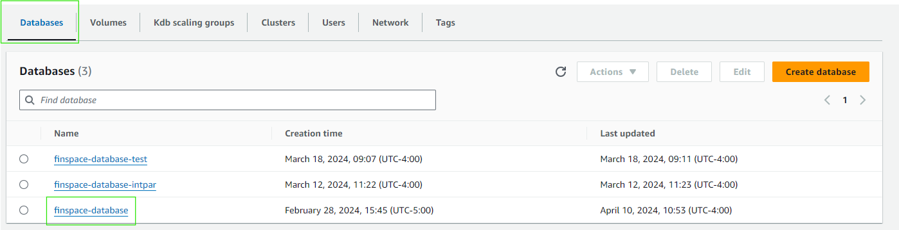

Creating Kx Managed Insight Scaling Groups, Shared Volumes, and AWS Finspace Dataviews
===============

*If you have set up your environment using our Terraform deployment option, this page is purely informative. These resources will have be created for you by Terraform.*

---------------

## Scaling Groups

To create a scaling group through the AWS Console, select your kdb environment and navigate to the "Kdb scaling groups" tab:

Click the "Create kdb scaling group" button

1. Provide a name for the kdb scaling group unique to the kdb environment. You will be asked to choose a Host type as well. Choose "kx.sg.4xlarge" or larger host type.
2. Select an Availability Zone make sure it includes your [previous created subnet](https://docs.aws.amazon.com/vpc/latest/userguide/create-subnets.html)
3. Click the "Create kdb scaling group" button when you are happy with the settings.

## Shared Volume

To create a shared volume through the AWS Console, select your kdb environment and navigate to the "Volumes" tab:

Click the "Create Volume" button

1. Provide a name for the volume unique to the kdb environment. You will be asked to choose a Volume Type. For now, "NAS_1" is the only option
2. Under NAS_1 configurations, provide details for the hardware type and the amount of disk capacity allocated. 
    - Choose either SSD_250 or SSD_1000 for the best performance
    - The size of allocated disk space must be at least 1200 GiB.

3. Choose an Availability Zone. It is recommended that it matches with the Availability Zone you assigned the kdb scaling group to run on
4. Click the "create volume" button when you are happy with the settings

## (Optional) Dataview 

*You must have a shared volume created to perform this step*

If you plan to run your HDB cluster on a scaling group this step is required. Otherwise, this step is optional.

To create a scaling group through the AWS Console, select your kdb environment and navigate to the "databases" tab:

Select the database that has the changesets appropriate for your use case.
To learn more about changesets click <placeholder>

1. Navigate to the "Dataview tab" and click the "Create dataview" button

1. Under "Dataview details" provide a name for your dataview that is unique to your kdb environment
2. Choose an Availability Zone. This must match the Availability Zone your kdb scaling group runs on

3. Under "Changeset update settings" you have the option of choosing two modes:
    - Auto-update : (Recommended) The dataview will automatically use data from the latest changeset
    - Static      : The dataview will use data from a pre-determined changeset id
4. Under "Segment Configuration" choose the root path for your "database path" and the volume you create in the prior step

Click "Create dataview" when you are happy with the settings
