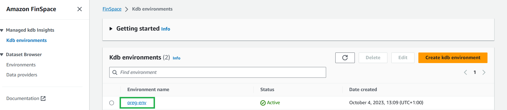
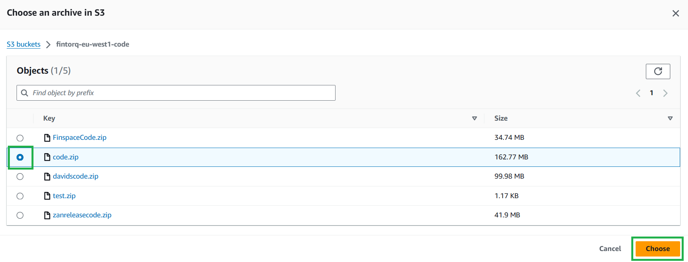
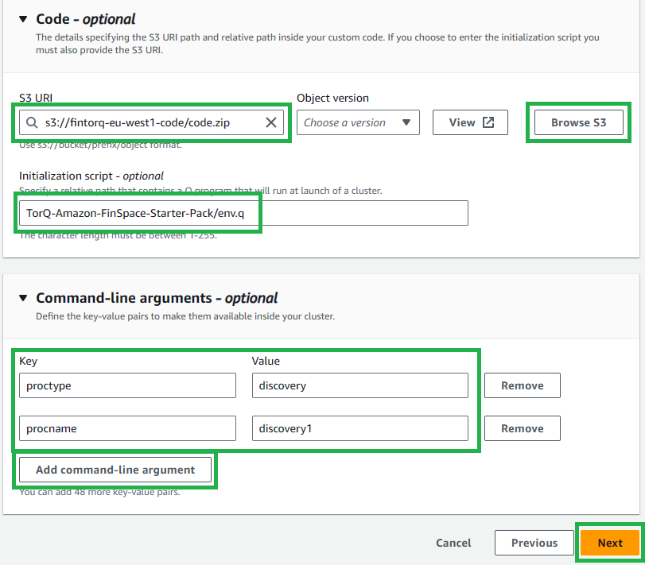
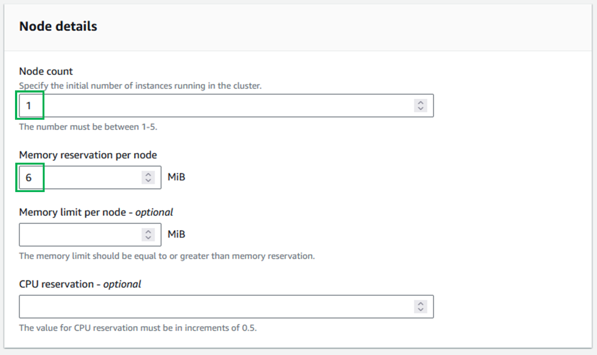
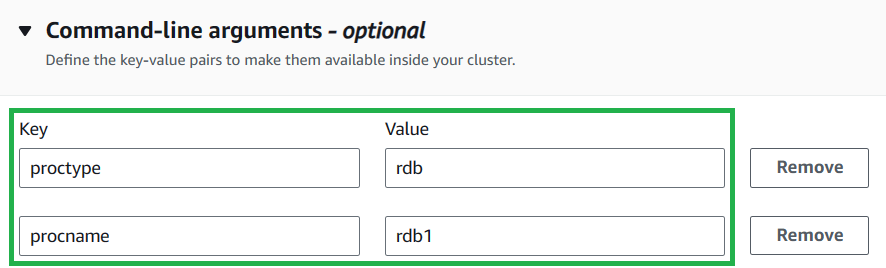
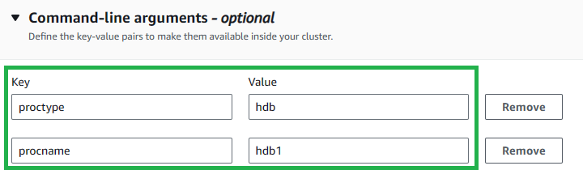
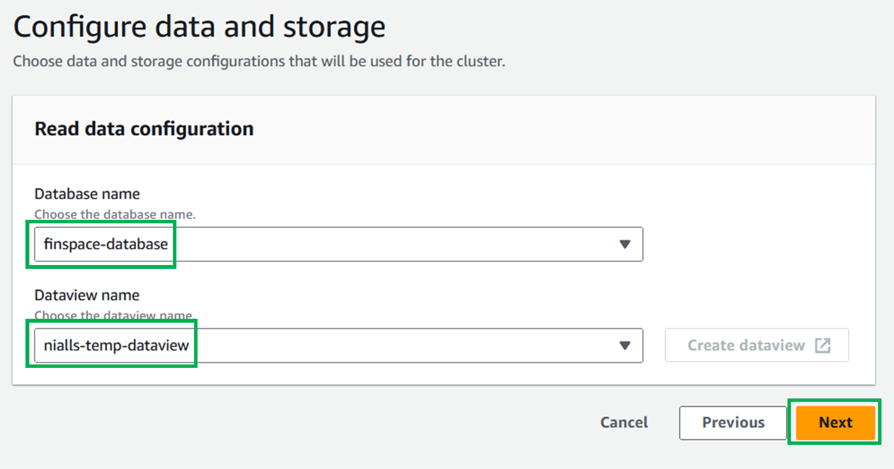
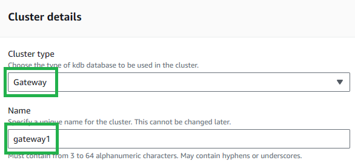
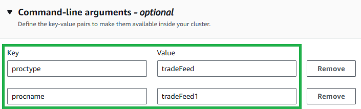
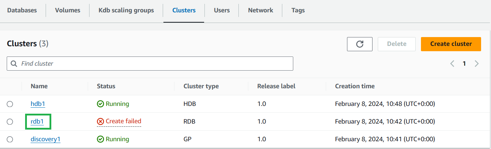

Creating TorQ Clusters
===============

*If you have set up your environment using our Terraform deployment option, this page is purely informative. Your clusters will have been created for you by Terraform.*

---------------

To create a cluster, first select your kdb environment:

    

Then select the `Clusters` tab, then either of the `Create cluster` buttons:

    

## Prerequisites

For these clusters, you will require:

- A kdb scaling group
- A database with:
  - A changeset
  - A dataview
- A volume

## Discovery Cluster

1. Set the `Cluster type` to `General purpose`, also known as "GP".

2. Choose a name for your cluster.
    - **Note:** This name must match your process name (`procname`) added during the next stage of cluster creation - This is due to process connections requiring the cluster name, which is not visible from within the process, but `procname` is. **Our suggestion is to use the process type** (`proctype`) **with a number**, e.g. `discovery1`.

3. Select the execution role for the [IAM user previously created](https://catalog.us-east-1.prod.workshops.aws/workshops/a1575309-1f43-4945-a5fa-a4d62d5e821d/en-US/rolesetup). The user for all 5 clusters should be the same. This is so that each cluster has the correct permissions.

    

        
    

4. Select `Run on kdb scaling group` for the Cluster running option.
   
    

        
    

5. Choose your group in the dropdown in the `Kdb scaling group details` section.

    

        
    

6. In the `Node details` section, set the `Memory reservation per node` to the minimum allowed (6 MiB) and leave the rest blank.
    
    

        
    

7. Leave Tags as empty and select `Next` to go to the next page.

8. Select `Browse S3`, search and select your codebucket and select your code.zip file.
    - Alternatively, you can copy the URL from the codebucket itself.

    

        
    

    

        
    

9.  Enter `TorQ-Amazon-FinSpace-Starter-Pack/env.q` as your initialization script.

10. Select `Add command-line argument` twice and enter the keys and values in the below table:

    | Key      | Value      |
    | -------- | ---------- |
    | proctype | discovery  |
    | procname | discovery1 |

    This specified initialization script and the command line arguments will set up the necessary environment for your cluster.

    

        
    

11. Select `Next` to go to the next page.

12. Select your previously created [VPC ID](https://docs.aws.amazon.com/vpc/latest/userguide/create-vpc.html), [Subnets](https://docs.aws.amazon.com/vpc/latest/userguide/create-subnets.html), and Security Groups (we can use the readily available default), then select `Next` to go to the next page.
    
    

        
    

13. Leave everything as blank and click `Next` to move on to the next page.
    
    

        
    

14. Check the entered information in the review page, then select `Create cluster`.

## Real-Time Database (RDB) Cluster

1. Set the cluster type to “RDB".

2. Choose a name for your cluster.
    - **Note:** This name must match your process name, `procname`, added during the next stage of cluster creation - This is due to process connections requiring the cluster name, which is not visible from within the process, but procname is. **Our suggestion is to use the process type** (`proctype`) **with a number** e.g. `rdb1`.

    

        
    

3. Select the execution role for the [IAM user previously created](https://catalog.us-east-1.prod.workshops.aws/workshops/a1575309-1f43-4945-a5fa-a4d62d5e821d/en-US/rolesetup). The user for all 5 clusters should be the same. This is so that each cluster has the correct permissions.

4. Select `Run on kdb scaling group` for the Cluster running option.
   
    

        
    

5. Choose your group in the dropdown in the `Kdb scaling group details` section.

    

        
    

6. Enter a node count of "1". This will be the number of instances in a cluster. For the MVP only 1 is needed.

7. Set `Memory reservation per node` to the minimum value (6 MiB).

8. Leave Tags as empty and select `Next` to go to the next page.

    

        
    

9. Select `Browse S3`, search and select your codebucket and select your code.zip file.
    - Alternatively, you can copy the URL from the codebucket itself.

10. Enter `TorQ-Amazon-FinSpace-Starter-Pack/env.q` as your initialization script.

11. Select `Add command-line argument` twice and enter the keys and values in the below table:

    | Key      | Value |
    | -------- | ----- |
    | proctype | rdb   |
    | procname | rdb1  |

    This specified initialization script and the command line arguments will set up the necessary environment for your cluster.

    

        
    

12. Select `Next` to go to the next page.

13. Select your previously created [VPC ID](https://docs.aws.amazon.com/vpc/latest/userguide/create-vpc.html), [Subnets](https://docs.aws.amazon.com/vpc/latest/userguide/create-subnets.html), and Security Groups (we can use the readilty available default), then select `Next` to go to the next page.

14. In the `Savedown database configuration` section, select your database in the `Database name` dropdown menu.

15. In the `Savedown storage configuration - optional` section, select your volume in the `Volume name - optional` dropdown menu.

16. Select `Next` to go to the next page.

    

        
    

17. Check the entered information in the review page, then select `Create cluster`.

## Historical Database (HDB) Cluster

1. Set the `Cluster type` to `HDB`.

2. Choose a name for your cluster.
    - **Note:** This name must match your process name, `procname`, added during the next stage of cluster creation - This is due to process connections requiring the cluster name, which is not visible from within the process, but procname is. **Our suggestion is to use the process type** (`proctype`) **with a number** e.g. `hdb1`.

    

        
    

3. Select the execution role for the [IAM user previously created](https://catalog.us-east-1.prod.workshops.aws/workshops/a1575309-1f43-4945-a5fa-a4d62d5e821d/en-US/rolesetup). The user for all 5 clusters should be the same. This is so that each cluster has the correct permissions.

4. Select `Run on kdb scaling group` for the Cluster running option.
   
    

        
    

5. Choose your group in the dropdown in the `Kdb scaling group details` section.

    

        
    

6. Enter a node count of "1". This will be the number of instances in a cluster. For the MVP only 1 is needed.

7. Set `Memory reservation per node` to the minimum value (6 MiB).

8. Leave Tags as empty and select `Next` to go to the next page.

    

        
    

9. Select `Browse S3`, search and select your codebucket and select your code.zip file.
    - Alternatively, you can copy the URL from the codebucket itself.

10. Enter `TorQ-Amazon-FinSpace-Starter-Pack/env.q` as your initialization script.

11. Select `Add command-line argument` twice and enter the keys and values in the below table:

    | Key      | Value |
    | -------- |------ |
    | proctype | hdb   |
    | procname | hdb1  |

    This specified initialization script and the command line arguments will set up the necessary environment for your cluster.

    

        
    

12. Select `Next` to go to the next page.

13. Select your previously created [VPC ID](https://docs.aws.amazon.com/vpc/latest/userguide/create-vpc.html), [Subnets](https://docs.aws.amazon.com/vpc/latest/userguide/create-subnets.html), and Security Groups (we can use the readilty available default), then select `Next` to go to the next page.

14. For `Database name`, select your database from the dropdown menu.

15.  For `Dataview name`, select your dataview from the dropdown menu.

16.  Select `Next` to go to the next page.

    

17. Check the entered information in the review page, then select `Create cluster`.

## Gateway Cluster

Ensure that the Discovery cluster is in a "Running" state before creating the Gateway cluster.

1. Set the `Cluster type` to `Gateway`.

2. Choose a name for your cluster.
    - **Note:** This name must match your process name, `procname`, added during the next stage of cluster creation - This is due to process connections requiring the cluster name, which is not visible from within the process, but procname is. **Our suggestion is to use the process type** (`proctype`) **with a number** e.g. `gateway1`.

    

        
    

3. Select the execution role for the [IAM user previously created](https://catalog.us-east-1.prod.workshops.aws/workshops/a1575309-1f43-4945-a5fa-a4d62d5e821d/en-US/rolesetup). The user for all 5 clusters should be the same. This is so that each cluster has the correct permissions.

4. Select `Run on kdb scaling group` for the Cluster running option.
   
    

        
    

5. Choose your group in the dropdown in the `Kdb scaling group details` section.

    

        
    

6. Enter a node count of "1". This will be the number of instances in a cluster. For the MVP only 1 is needed.

7. Set `Memory reservation per node` to the minimum value (6 MiB).

8. Leave Tags as empty and select `Next` to go to the next page.

    

        
    

9. Select `Browse S3`, search and select your codebucket and select your code.zip file.
    - Alternatively, you can copy the URL from the codebucket itself.

10. Enter `TorQ-Amazon-FinSpace-Starter-Pack/env.q` as your initialization script.

11. Select `Add command-line argument` twice and enter the keys and values in the below table:

    | Key      | Value    |
    | -------- | -------- |
    | proctype | gateway  |
    | procname | gateway1 |

    This specified initialization script and the command line arguments will set up the necessary environment for your cluster.

    

        
    

12. Select `Next` to go to the next page.

13. Select your previously created [VPC ID](https://docs.aws.amazon.com/vpc/latest/userguide/create-vpc.html), [Subnets](https://docs.aws.amazon.com/vpc/latest/userguide/create-subnets.html), and Security Groups (we can use the readilty available default), then select `Next` to go to the next page.

14. This page had no editing options. Select `Next` to go to the next page.

15. Check the entered information in the review page, then select `Create cluster`.

## Feed Cluster

Ensure that the RDB cluster is in a `Running` state before creating the Feed cluster.

1. Set the `Cluster type` to `General purpose`, also known as "GP".

2. Choose a name for your cluster. As this is a sample feed and not a "production" intended process, please name it `feed1`.

    

        
    

3. Select the execution role for the [IAM user previously created](https://catalog.us-east-1.prod.workshops.aws/workshops/a1575309-1f43-4945-a5fa-a4d62d5e821d/en-US/rolesetup). The user for all 5 clusters should be the same. This is so that each cluster has the correct permissions.

4. Select `Run on kdb scaling group` for the Cluster running option.
   
    

        
    

5. Choose your group in the dropdown in the `Kdb scaling group details` section.

    

        
    

6. In the `Node details` section, set the `Memory reservation per node` to the minimum allowed (6 MiB) and leave the rest blank.
    
    

        
    

7. Leave Tags as empty and select `Next` to go to the next page.

8. Select `Browse S3`, search and select your codebucket and select your code.zip file.
    - Alternatively, you can copy the URL from the codebucket itself.

9. Enter `TorQ-Amazon-FinSpace-Starter-Pack/env.q` as your initialization script.

10. Select `Add command-line argument` twice and enter the keys and values in the below table:

    | Key      | Value      |
    | -------- | ---------- |
    | proctype | tradeFeed  |
    | procname | tradeFeed1 |

    This specified initialization script and the command line arguments will set up the necessary environment for your cluster.

    

        
    

11. Select `Next` to go to the next page.

12. Select your previously created [VPC ID](https://docs.aws.amazon.com/vpc/latest/userguide/create-vpc.html), [Subnets](https://docs.aws.amazon.com/vpc/latest/userguide/create-subnets.html), and Security Groups (we can use the readilty available default), then select `Next` to go to the next page.

13. Leave everything as blank and click `Next` to move on to the next page.

    

        
    

14. Check the entered information in the review page, then select `Create cluster`.

## On Completion

When all clusters are up it should look like this:

    

## Errors in cluster creation

On cluster creation, most errors will result in your cluster going to a `Create failed` state.

    

If that is the case you should:

- Click the cluster name in the `Clusters` section of your environment.

    

        
    

- Scroll down the page and open the `Logs` tab. This should have a message with a more individualised error you can check.

- If you click the LogStream for an individual log it will take you to AWS CloudWatch where you can filter the messages for keywords or for messages in a certain time window.

    

        
    

It is worthwhile checking the logs even for clusters that have been created and searching for terms like `err`, `error` or `fail`.