Creating and Connect to an EC2 Instance
===============

## Create a Windows EC2 Instance

Navigate to the EC2 service.

    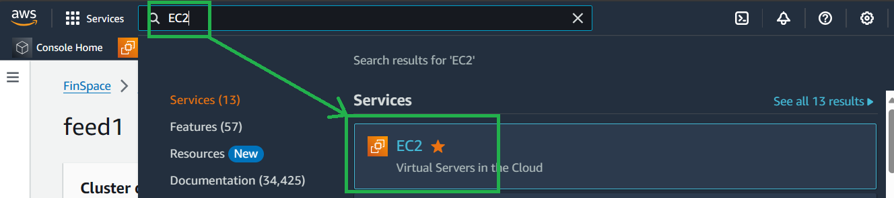

Select `Launch instance` to create a new EC2 instance.

    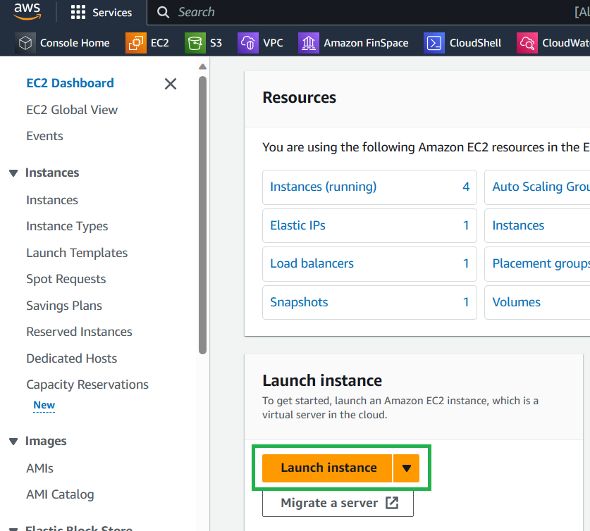

Most options here can be left as their defaults. Here are the ones that need selected/changing:

1. Select "Windows" from the `Quick Start` options.

    

        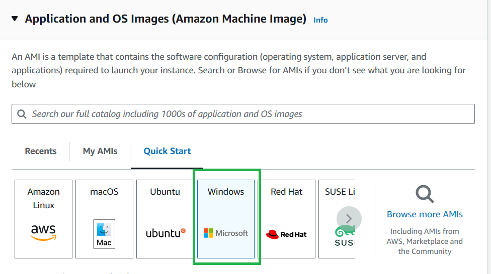
    

2. We need to create a new key pair: Select `Create new key pair`.

    

        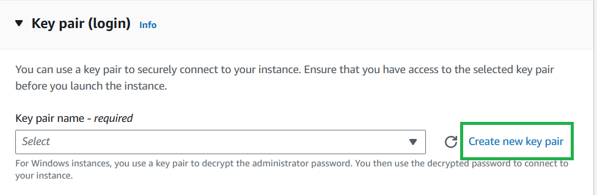
    

3. Enter a name for your key pair, leave the key pair type as `RSA` and the file format as `.pem`. This will download a key file to you PC which you will use to connect to the instance.

    

        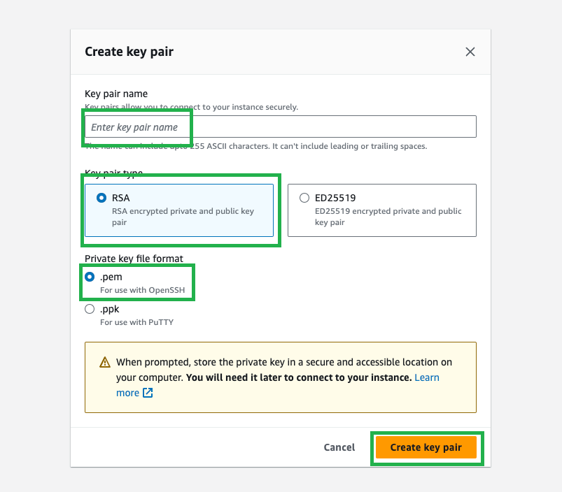
    

The network should be in the same VPC as your cluster. Select `Create security group` that allows Remote Desktop Protocol (RDP) connections from anywhere.
    - This is only for the purposes of the MVP. For customising see [this page](https://docs.aws.amazon.com/AWSEC2/latest/UserGuide/working-with-security-groups.html) on security groups.

    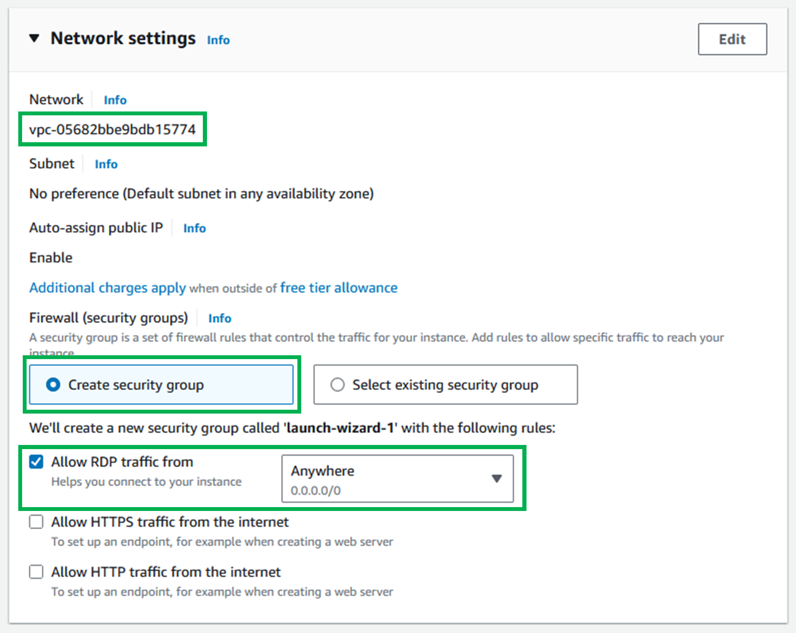

## Adding your new security group to you EC2

Now we need to add the security group of your cluster to your EC2.

Navigate to EC2 service.

    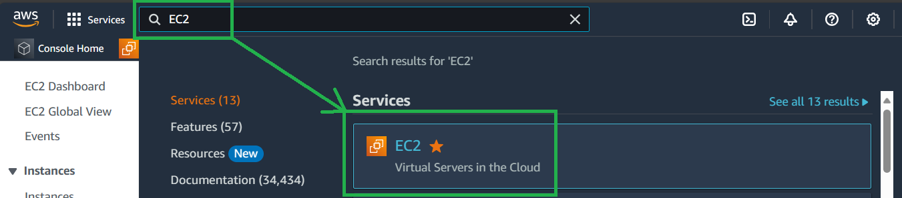

Select `Instances (running)`.

    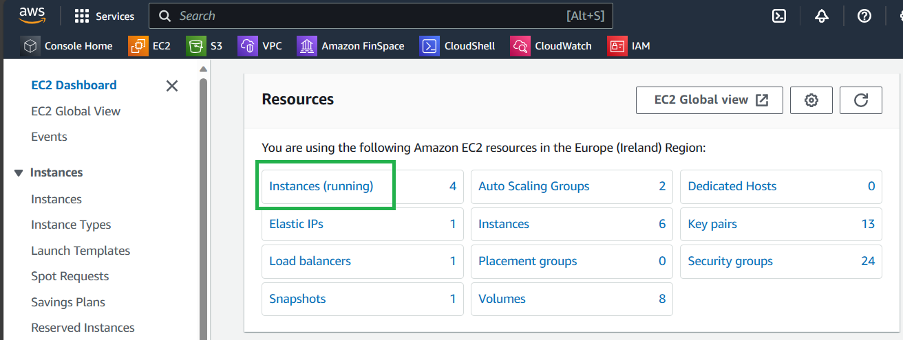

Open your EC2 Instance.

    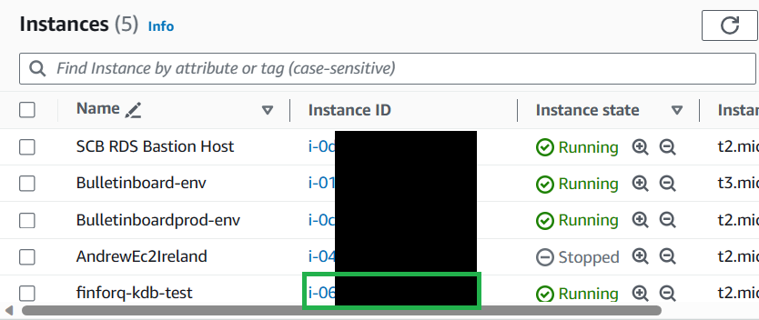

Select `Actions`, `Security` then `Change security groups`.

    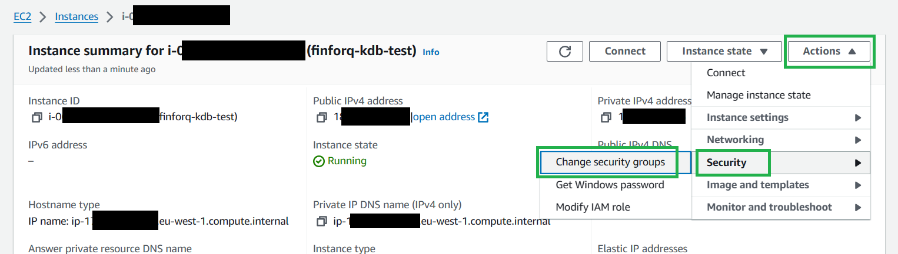

Search and select the security group that is on your clusters, select `Add security group` then `Save`.

    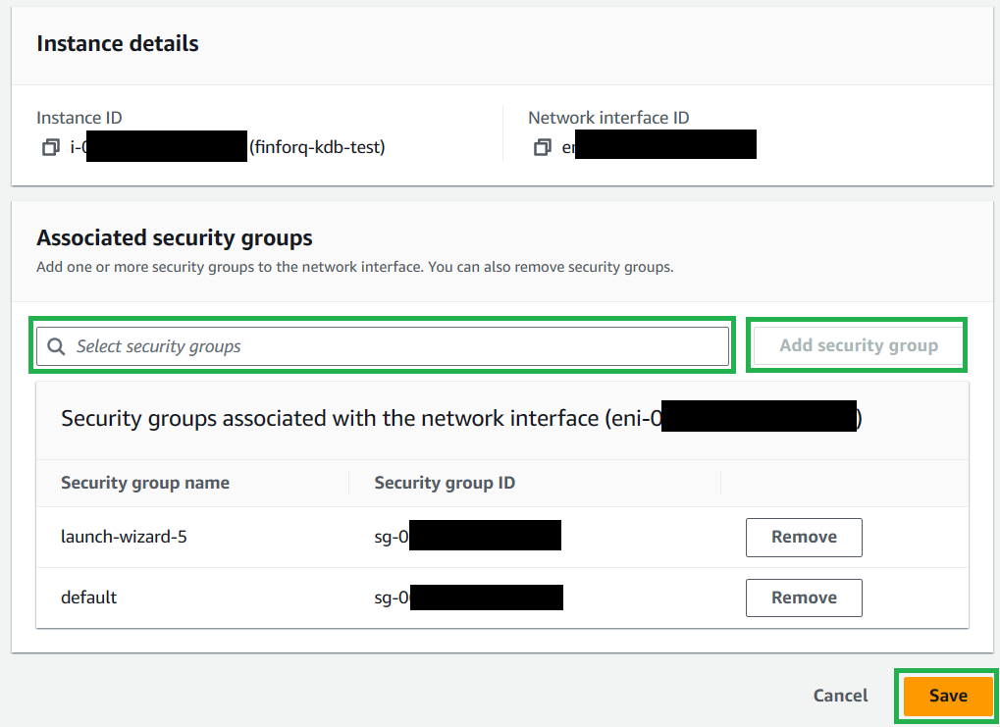

You should now have two security groups, one from the launch wizard, and the one you added manually that is also attached to your clusters.

    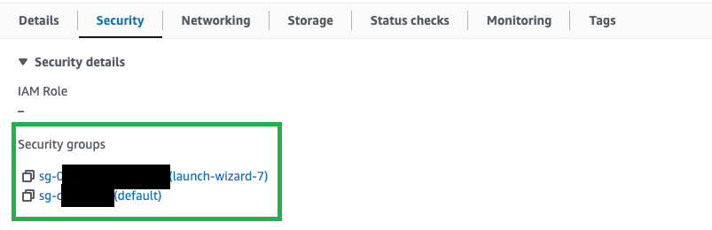

## Connecting to your EC2 Instance

Open your EC2 Instance.

    

Select connect.

    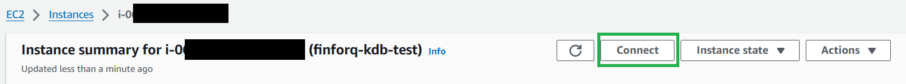

### Get your password

This only needs to be done once. Once you have this password you can skip this step.

Select get password.

    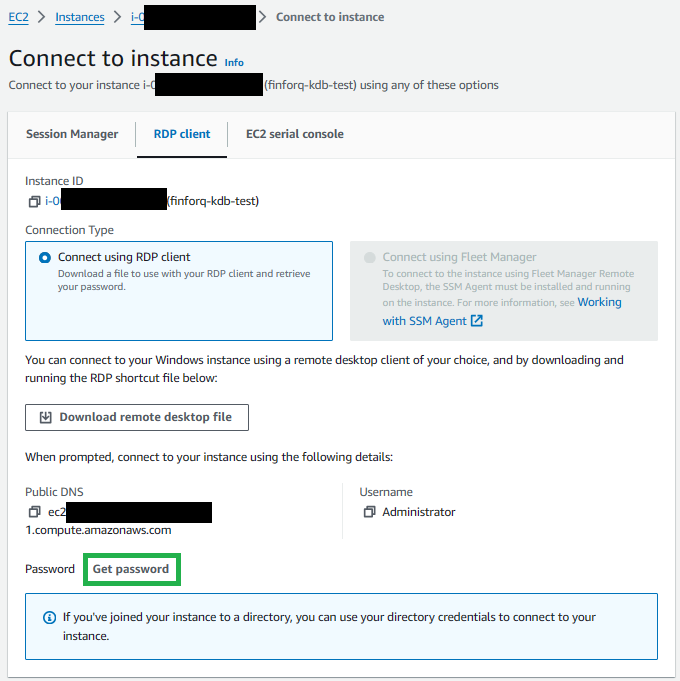

Upload the `.pem` that was saved to you PC earlier (alternativly you can just paste the contents of this file in the text box).

    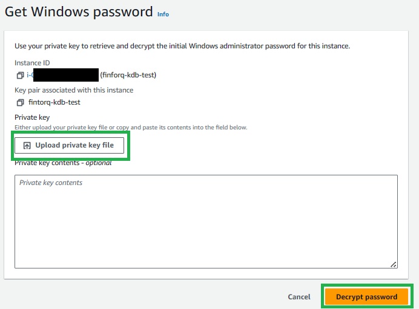

This will return the value of your password. Keep a note of this password as you will need it to connect your EC2.

### Connect

Download the remote desktop file.

    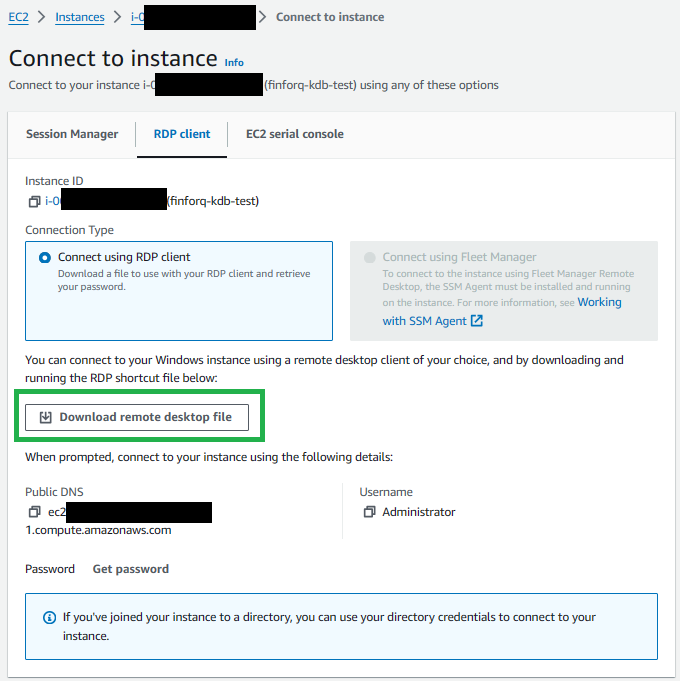

Run this file and enter the password you recieved above when promted. You should now be connected to the Windows remote desktop.