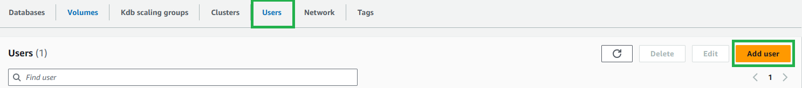
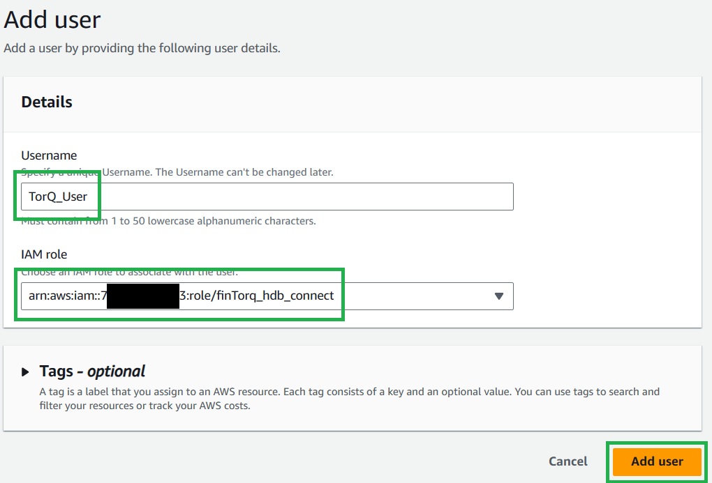
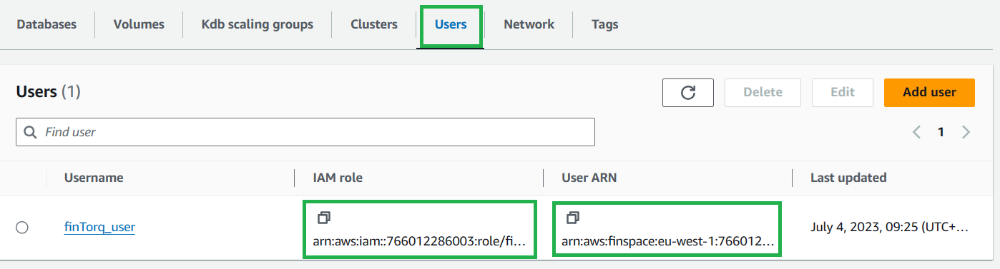
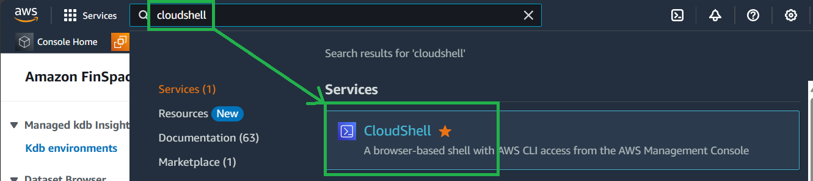
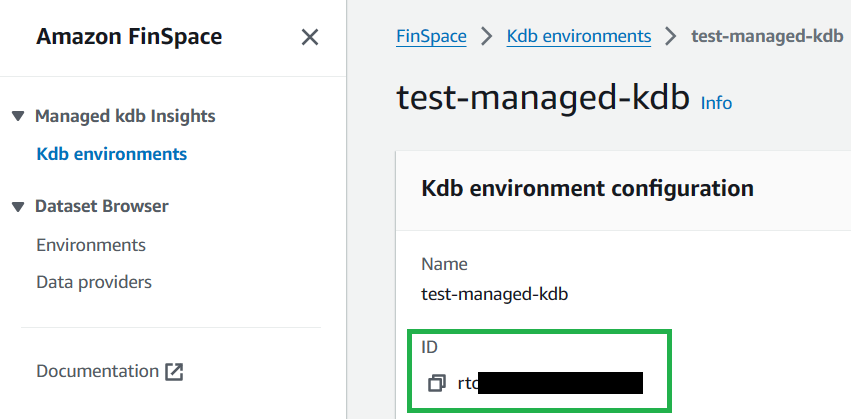
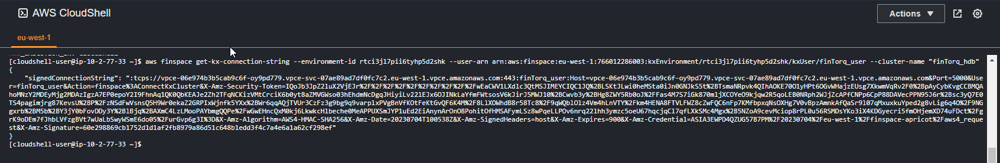

Cluster Connection String
===============

*Terraform users can skip to our [generate connection string section](#generate-connection-string) as Terraform will have created and set up your role and user for you.*

---------------

## Ensure Your Role has Correct Permissions (If manually set up (not useing Terraform))

### Policy

The policy you created needs to have at least these permissions (Note the ARN should match that of your created cluster):

    {
        "Version": "2012-10-17",
            "Statement": [
                {
                    "Effect": "Allow",
                    "Action": "finspace:ConnectKxCluster",
                    "Resource": "<ENVIRONMENT_ARN_COPIED_FROM_KDB_ENIRONMENT_PAGE>/kxCluster/*"
                },
                {
                    "Effect": "Allow",
                    "Action": "finspace:GetKxConnectionString",
                    "Resource": "<ENVIRONMENT_ARN_COPIED_FROM_KDB_ENIRONMENT_PAGE>/kxCluster/*"
                }
        ]
    }

### Role

We need to check the Trust Policy of your created role.

Search for the role and open it in the IAM console. Go to Trust relationships.

Your Trust relationship should have at least these:
    
    {
        "Version": "2012-10-17",
        "Statement": [
            {
                "Effect": "Allow",
                "Principal": {
                    "Service": "finspace.amazonaws.com",
                    "AWS": "arn:aws:iam::<ACCOUNT_ID>:root"
                },
                "Action": "sts:AssumeRole"
            }
        ]
    }

## Create a user (If manually set up (not useing Terraform))

In your kdb environment, go to the Users tab and select Add user.

Give it a name and select the IAM role you created above.

## Generate Connection String

On the users tab, copy the links for IAM role and User ARN for the user.

Navigate to CloudShell.

Replace ``<ARN_COPIED_FROM_ABOVE>`` with the IAM Role copied above and run the following (this will not return anything):

    export $(printf "AWS_ACCESS_KEY_ID=%s AWS_SECRET_ACCESS_KEY=%s AWS_SESSION_TOKEN=%s" \
    $(aws sts assume-role \
    --role-arn <ARN_COPIED_FROM_ABOVE> \
    --role-session-name "connect-to-finTorq" \
    --query "Credentials.[AccessKeyId,SecretAccessKey,SessionToken]" \
    --output text))

This lets you assume the role that you have just created by taking the values returned from the aws sts assume-role command and setting them in your AWS_ACCESS_KEY_ID... etc environment variables. NOTE - if you need to switch back to your own user within the CloudShell, you will need to run unset AWS_ACCESS_KEY_ID AWS_SECRET_ACCESS_KEY AWS_SESSION_TOKEN to unset these environment variables.

Copy your kdb Environment Id:

Replace ``<YOUR_KDB_ENVIRONMENT_ID>`` with your kdb environment ID, ``<USER_ARN_COPIED_ABOVE>`` with the User ARN, and ``<NAME_OF_CLUSTER>`` with the name of the cluster you want to connect to. Run the following:

    aws finspace get-kx-connection-string --environment-id <YOUR_KDB_ENVIRONMENT_ID> --user-arn <USER_ARN_COPIED_ABOVE> --cluster-name <NAME_OF_CLUSTER>

This will return a large connection string which can be used to connect to your cluster.

