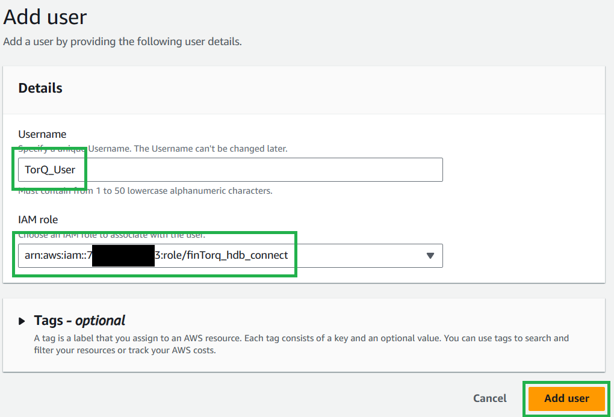
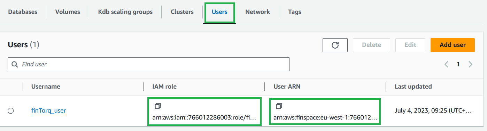
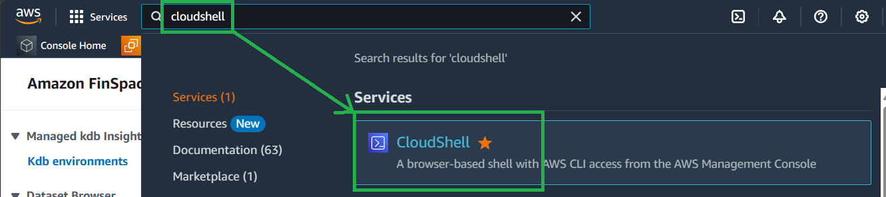
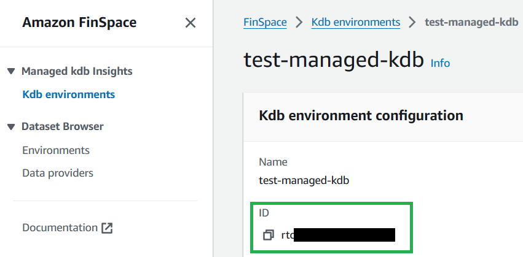
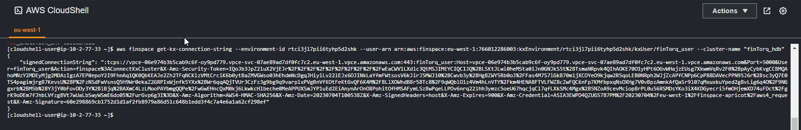

Cluster Connection String
===============

*Terraform users can skip to our [generate connection string section](#generate-connection-string) as Terraform will have created and set up your role and user for you.*

---------------

## Ensure Your Role has Correct Permissions (If manually set up (not useing Terraform))

### Policy

The policy you created needs to have at least these permissions (Note the ARN should match that of your created kxEnvironment):

    {
        "Version": "2012-10-17",
            "Statement": [
                {
                    "Effect": "Allow",
                    "Action": "finspace:ConnectKxCluster",
                    "Resource": "<ENVIRONMENT_ARN_COPIED_FROM_KDB_ENIRONMENT_PAGE>/kxCluster/*"
                },
                {
                    "Effect": "Allow",
                    "Action": "finspace:GetKxConnectionString",
                    "Resource": "<ENVIRONMENT_ARN_COPIED_FROM_KDB_ENIRONMENT_PAGE>/kxCluster/*"
                }
        ]
    }

To enable endofday savedowns and your clusters access to your S3 code and data buckets, you will also need the following statements to your policy

```
{
         "Statement": [
                 {
                         "Effect": "Allow",
                         "Action": [
                             "finspace:UpdateKxClusterDatabases"
                          ]
                         "Resource": [
                              "<ENVIRONMENT_ARN_COPIED_FROM_KDB_ENIRONMENT_PAGE>/kxCluster/*",
                              "<ENVIRONMENT_ARN_COPIED_FROM_KDB_ENIRONMENT_PAGE>/kxDatabase/*/kxDataview/*",
                          ]
                 },
                 {
                         "Effect": "Allow",
                         "Action": [
                             "s3:ListBucket",
                             "s3:GetObject",
                             "s3:GetObjectVersion",
                             "s3:GetObjectTagging"
                          ]
                         "Resource": [
                              "<YOUR_S3_CODE_BUCKET_ARN>",
                              "<YOUR_S3_CODE_BUCKET_ARN>/*",
                              "<YOUR_S3_DATA_BUCKET_ARN>",
                              "<YOUR_S3_DATA_BUCKET_ARN>/*"
                          ] 
                 }
         ]
 }
```

To find out how to get the ARN of your S3 buckets reference https://dataintellecttech.github.io/TorQ-Finance-Starter-Pack/04-prerequisites.md

### Role

We need to check the Trust Policy of your created role.

Search for the role and open it in the IAM console. Go to `Trust relationships`.

Your Trust relationship should have at least these:
    
    {
        "Version": "2012-10-17",
        "Statement": [
            {
                "Effect": "Allow",
                "Principal": {
                    "Service": "finspace.amazonaws.com",
                    "AWS": "arn:aws:iam::<ACCOUNT_ID>:root"
                },
                "Action": "sts:AssumeRole"
            }
        ]
    }

## Create a user (If manually set up (not useing Terraform))

In your kdb environment, go to the `Users` tab and select `Add user`.

<p style="text-align: center">
    
</p>

Give it a name and select the `IAM role` you created above.

<p style="text-align: center">
    
</p>

## Generate Connection String

On the `Users` tab, copy the links for `IAM role` and `User ARN` for the user.

<p style="text-align: center">
    
</p>

Navigate to `CloudShell`.

<p style="text-align: center">
    
</p>

Replace `<ARN_COPIED_FROM_ABOVE>` with the `IAM Role` copied above and run the following (this will not return anything):

    export $(printf "AWS_ACCESS_KEY_ID=%s AWS_SECRET_ACCESS_KEY=%s AWS_SESSION_TOKEN=%s" \
    $(aws sts assume-role \
    --role-arn <ARN_COPIED_FROM_ABOVE> \
    --role-session-name "connect-to-finTorq" \
    --query "Credentials.[AccessKeyId,SecretAccessKey,SessionToken]" \
    --output text))

This lets you assume the role that you have just created by taking the values returned from the `aws sts assume-role` command and setting them in your `AWS_ACCESS_KEY_ID`, e.t.c. environment variables. NOTE - if you need to switch back to your own user within the CloudShell, you will need to run `unset AWS_ACCESS_KEY_ID AWS_SECRET_ACCESS_KEY AWS_SESSION_TOKEN` to unset these environment variables.

Copy your kdb Environment ID:

<p style="text-align: center">
    
</p>

Replace `<YOUR_KDB_ENVIRONMENT_ID>` with your kdb environment ID, `<USER_ARN_COPIED_ABOVE>` with the `User ARN`, and `<NAME_OF_CLUSTER>` with the name of the cluster you want to connect to. Run the following:

    aws finspace get-kx-connection-string --environment-id <YOUR_KDB_ENVIRONMENT_ID> --user-arn <USER_ARN_COPIED_ABOVE> --cluster-name <NAME_OF_CLUSTER>

This will return a large connection string which can be used to connect to your cluster.

<p style="text-align: center">
    
</p>
