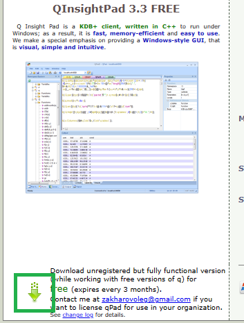
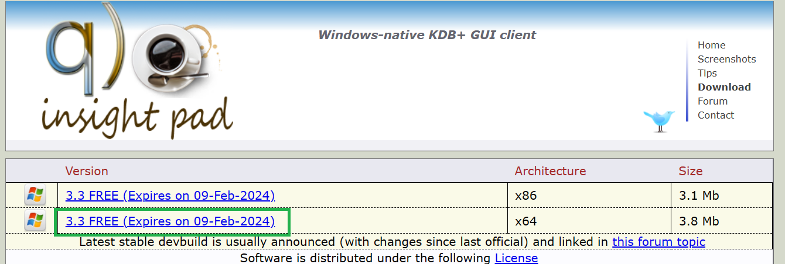

Setup QPad
===============

You must follow these steps from within your EC2 instance.

## Download QPad

Navigate to the [qInsightPad](https://www.qinsightpad.com/) website and select the download arrow.

Download the relavent version (usually x64).

Download the [Microsoft C++ 2010 service pack](https://www.microsoft.com/en-gb/download/details.aspx?id=26999) (there is a specific DLL from this that you need that is usually installed on Windows machines).

Select the relavent version (usually x64).

Run the file that was just downloaded.

Search for ‘Edit Environment variables’ and add ``SSL_VERIFY_SERVER=NO`` as one of them.

