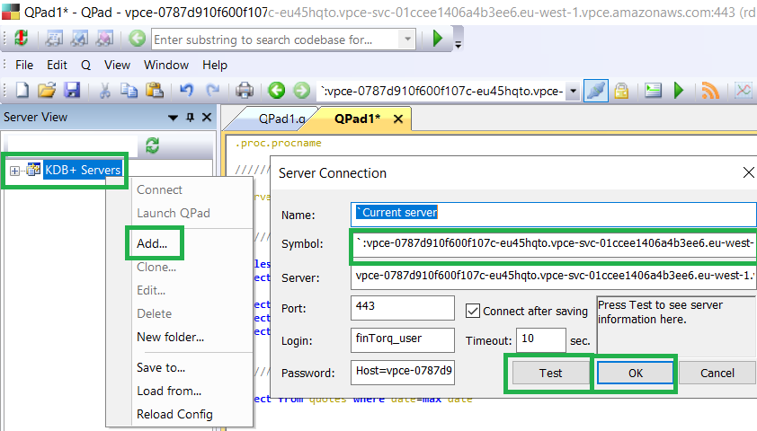

Connecting USing QPad
===============

Open qpad, right-click on KDB+ Servers and Add New Server.

Copy everything in the connection string into the symbol field except the beginning ``tcp://``.

Click test and then click OK to save. You have 60 minutes from the creation of your connection string before the connection string becomes stale and requires to be re-generated.

