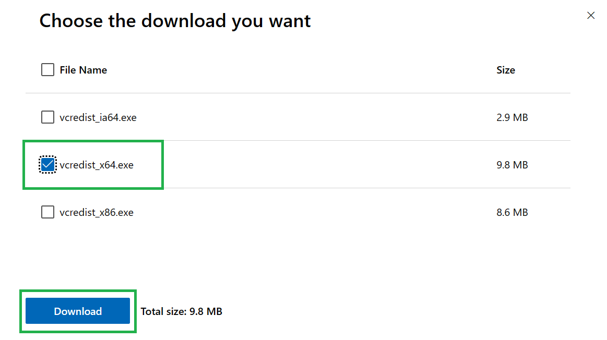

Setup qStudio
===============

You must follow these steps from within your EC2 instance.

## Download qStudio

Navigate to the [TimeStored](https://www.timestored.com/qstudio/download) website and download the relavent version (usually x64).

    

Download the [Microsoft C++ 2010 service pack](https://www.microsoft.com/en-gb/download/details.aspx?id=26999) (there is a specific DLL from this that you need that is usually installed on Windows machines).

    

Select the relevant version (usually x64).**

    

Run the file that was just downloaded.

Search for ‘Edit Environment variables’ and add `SSL_VERIFY_SERVER=NO` as one of them.

    

    

    

