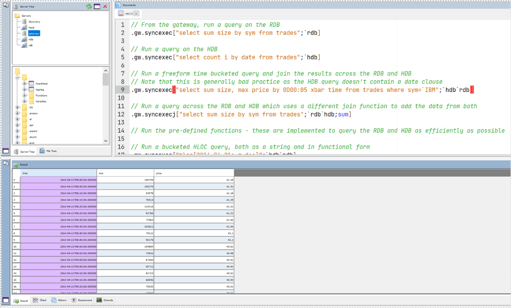

Running Queries
===============

Some example queries have been implemented on the RDB and HDB processes. These are defined in ``$KDBCODE/rdb/examplequeries.q`` and ``$KDBCODE/hdb/examplequeries.q``. These can be run directly on the processes themselves, or from the gateway which will join the results if querying across processes. To test, connect to the gateway cluster.

Example queries are listed below:

    // From the gateway, run a query on the RDB
    .gw.syncexec["select sum size by sym from trades";`rdb]

    // Run a query on the HDB
    .gw.syncexec["select count i by date from trades";`hdb]

    // Run a freeform time bucketed query and join the results across the RDB and HDB
    // Note that this is generally bad practice as the HDB query doesn't contain a date clause
    .gw.syncexec["select sum size, max price by 0D00:05 xbar time from trades where sym=`IBM";`hdb`rdb]

    // Run a query across the RDB and HDB which uses a different join function to add the data from both 
    .gw.syncexecj["select sum size by sym from trades";`rdb`hdb;sum]

    // Run the pre-defined functions - these are implemented to query the RDB and HDB as efficiently as possible

    // Run a bucketed HLOC query, both as a string and in functional form
    .gw.syncexec["hloc[2015.01.07;.z.d;0D12]";`hdb`rdb]
    .gw.syncexec[(`hloc;2015.01.07;.z.d;0D12);`hdb`rdb]

    // Run a count by sym across a date range, and add the results. 
    // Run both as a string and in functional from
    .gw.syncexecj["countbysym[2015.01.07;.z.d]";`hdb`rdb;sum]
    .gw.syncexecj[(`countbysym;2015.01.07;.z.d);`hdb`rdb;sum]

    // Run a gateway query with a bespoke join function to line up results and compare today's data with historic data
    .gw.syncexecj[(`countbysym;2015.01.07;.z.d);`hdb`rdb;{(`sym xkey select sym,histavgsize:size%tradecount from x 0) lj `sym xkey select sym,todayavgsize:size%tradecount from x 1}]

    // Send a query for a process type which doesn't exist
    .gw.syncexec["select count i by date from trades";`hdb`rubbish]

    // Send a query which fails
    .gw.syncexec["1+`a";`hdb]
