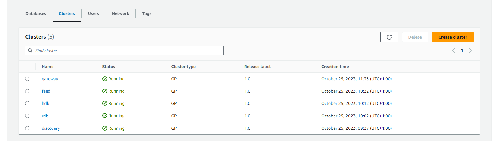

Check your system is healthy
===============

## Check If the System Is Running

Below is an example of what running clusters look like. You can find this page by going to the AWS console -> Amazon Finspace -> Kdb Environment -> select your environment -> clusters tab.

    

## Run some queries

Follow steps on [our Running Queries page](https://dataintellecttech.github.io/TorQ-Amazon-FinSpace-Starter-Pack/11-runningqueries/) to run some queries on your Gateway to check there are no errors and data is being returned (if there is data available).

## Check tables are populated/growning

If you would like to go into each process to check their health, here are a few details on how.

### Check Server Connections - .servers.SERVERS

Each TorQ process has a table called `.servers.SERVERS` that is used to track connections. Each process (with the exception of the Feed) should have at least one connection in this table to the discovery process (the discovery will have connections to all live processes).

If a handle is shown within this table - column `w` - you can assume the connection is active.

### Heartbeats - .hb.hb

All processes regularly publish a signal to show it is still active. This signal is called a heartbeat. Heartbeats are received and a summary can be seen stored within the `.hb.hb` table.

The discovery process can be used to view the heartbeat of all processes (with the exception of the Feed).

### Cloudwatch Alarms

In cloudwatch, it may be beneficial to set up an alarm to alert you if a particular log has been recorded.

The steps to do this can be found here: [AWS Cloudwatch Alarms.](https://docs.aws.amazon.com/AmazonCloudWatch/latest/monitoring/Create_alarm_log_group_metric_filter.html)

You can set an alarm for any possible log output, one that may be helpful in particular is to monitor the logs for an unsuccessful writedown/creation of a changeset. At which point this may need to be investigated further.i