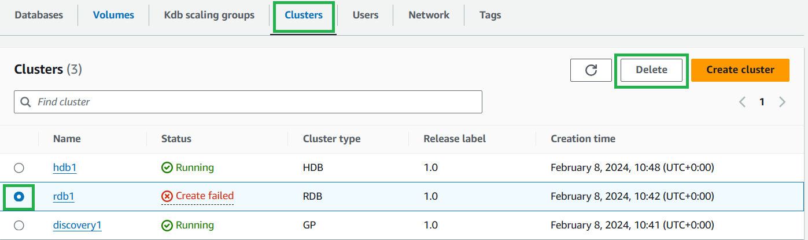
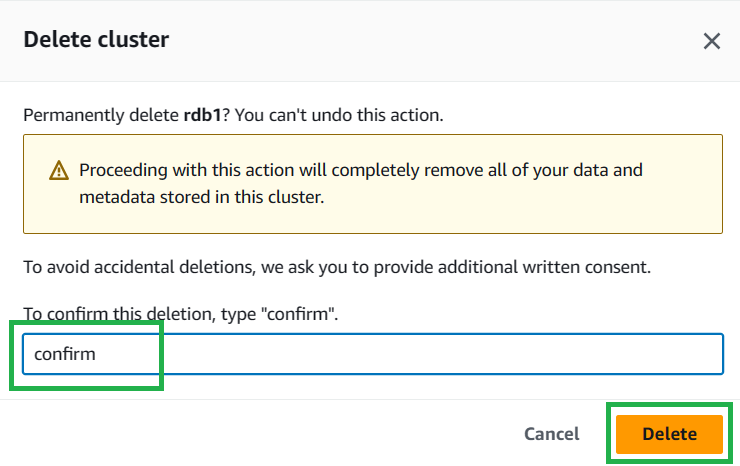
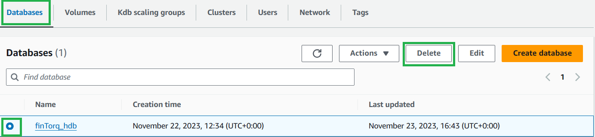

Taking it Down
===============

## Deleting clusters
From your Kdb environmnet select the cluster you want to delete and select "Delete".

On the confirmation dialog box, enter confirm then select “Delete”.

## Deleting your database 

From your Kdb environment select the "Databases" tab, select the database you want to delete and select "Delete".

On the confirmation dialog box, enter confirm then select “Delete”.

