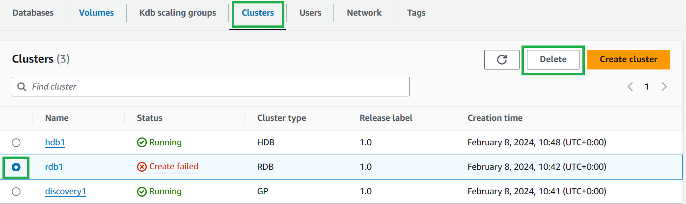
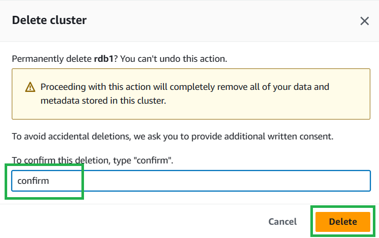
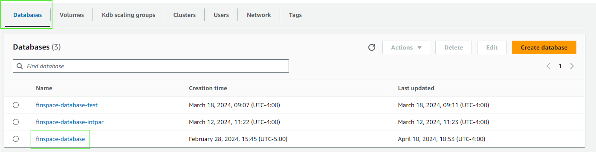
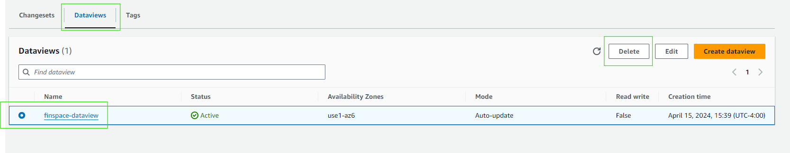
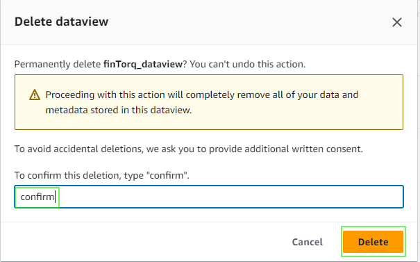
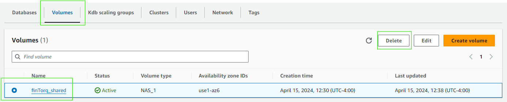
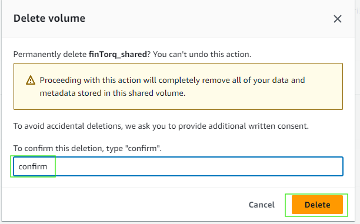
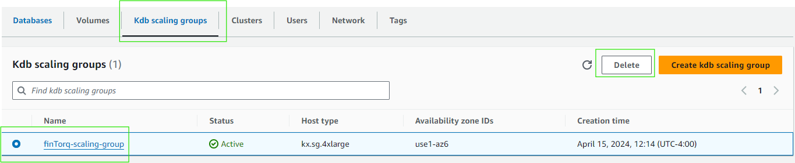
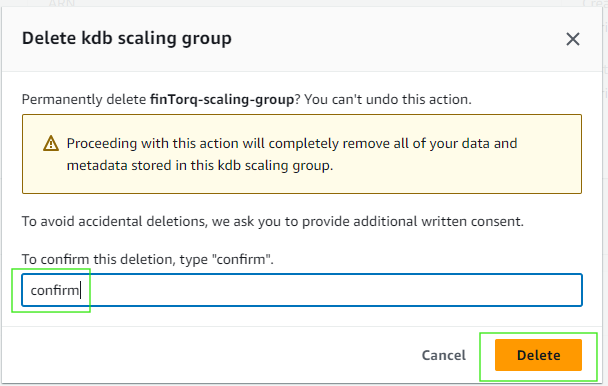
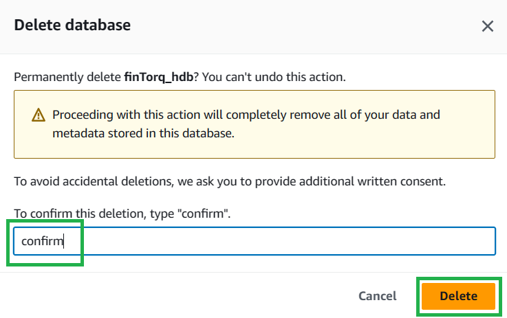

Taking it Down
===============

## Deleting clusters

From your Kdb environment select the cluster you want to delete and select `Delete`.

    

On the confirmation dialog box, enter confirm then select `Delete`.

    

## Deleting your dataview
*This step only applies if you created a dataview*

1. Select your kdb environment and navigate to the `Databases` tab. Then select the database your dataview is associated with:

    

1. Navigate to the `Dataviews` tab. Select the circular button to the left of the dataview you want to delete. 
2. Click the `Delete` button

    

1. On the confirmation dialog box, type "confirm" and then click the `Delete` button.

    

## Deleting your Shared Volume

1. Select your kdb environment and navigate to the `Volumes` tab. Then select the volume you like to delete and click `Delete`

    

1. On the confirmation dialog box, type "confirm" and then click the `Delete` button.

    

## Deleting your Kdb Scaling Group
**Important: Delete any clusters running on your scaling group before deleting the scaling group**

1. Select your kdb environment and navigate to the `Kdb scaling groups` tab. Then select the scaling group you like to delete and click `Delete`

    

1. On the confirmation dialog box, type "confirm" and then click the `Delete` button.

    

## Deleting your database 

From your Kdb environment select the `Databases` tab, select the database you want to delete and select `Delete`.

    

On the confirmation dialog box, enter confirm then select `Delete`.

    

