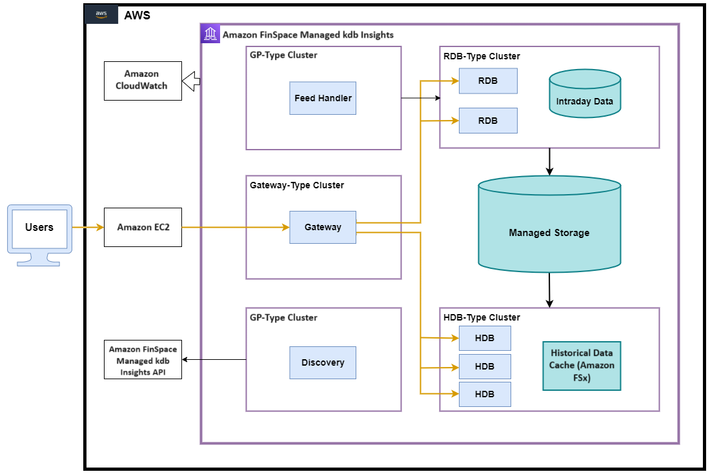

Architecture
===============

When porting TorQ to Managed kdb Insights we chose to make a minimum viable product and then build out features on top of this. This decision was made so that clients can get a working AWS solution that includes the essential TorQ features that are supported by Managed kdb Insights. We intend to align with the “Amazon FinSpace with Managed kdb Insights” roadmap, adding additional functionality to the TorQ implementation as new “Managed kdb Insights” features become available. The processes available in our first iteration of TorQ on Managed kdb Insights are the following: 

- Discovery: processes use the discovery service to register their own availability, find other processes (by process type), and subscribe to receive updates for new process availability (by process type). The discovery service does not manage connections- it simply returns tables of registered processes, irrespective of their current availability. It is up to each individual process to manage its own connections.

- Historical Database: the HDB is a database stored in AWS S3. Historical data is stored in date partitions and can be queried through the gateway process.

- Real-time Database: The RDB receives data from the feed handler throughout the day and stores it in in-memory tables for faster access.

- Feed Handler: The feed handler acts as a preparation stage for the data, transforming the data into kdb+ format and writing it to our RDB. The current version of code has the feed handler pushing simulated data to the RDB.

- Gateway: The gateway connects to the RDB and HDB processes and runs queries against them. It can access a single process, or join data across multiple processes. It also does load balancing and implements a level of resilience by hiding back-end process failure from clients.

These features allow us to store real-time and historical data and make it available to users. 

