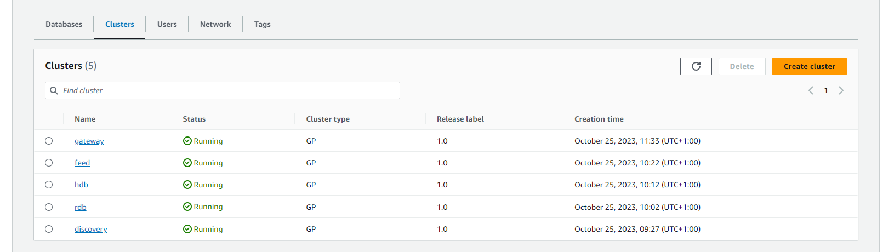

Getting Started
===============

The TorQ Finspace Starter Pack is designed to run on Amazon Managed kdb Insights. It contains an optional small initial
database of 260MB. As the system runs, data is fed in and written to a managed kdb database at end of day.

Installation and Configuration
------------------------------

### Prerequisites

1. An AWS account with an AdministratorAccess policy to create the Managed kdb Insights resources.

2. You need a KX insights license applied to our account. If you don’t have one see [Activate your Managed kdb Insights license - Amazon FinSpace](https://docs.aws.amazon.com/finspace/latest/userguide/kdb-licensing.html).

3. Inside a Linux system you will need to download the [TorQ](https://github.com/DataIntellectTech/TorQ/tree/master) and [TorQ FinSpace Starter Pack](https://github.com/DataIntellectTech/TorQ-Amazon-FinSpace-Starter-Pack/tree/master) GitHub code repos.

Start Up
--------

1. Zip up TorQ and TorQ-Amazon-FinSpace-Starter-Pack and name it code.zip

2. Follow the steps in our [Terraform documentation](https://dataintellecttech.github.io/TorQ-Amazon-FinSpace-Starter-Pack/terraformdeloyment/) to get your environment and clusters (processes) started.

The process of setting up a working Managed kdb Insights environment manually can take some time - especially if you are new to AWS. To aid this process we have a Terraform deployment option which should allow you to boot TorQ in Managed kdb Insights in a few simple commands. This Terraform script can be used to deploy an entire environment from scratch. Including creating and uploading data to s3 buckets with required policies, creating IAM roles, and creating network and transit gateway, as well as deploying clusters.

It is split into two modules, one for the environment and one for the clusters - which makes the directory more organised and easier to manage cluster deployment. The cluster module is still dependent on the environment module as it will import some variables from here that are needed for cluster creation.

For setting up your environment and/or clusters manually, more details will become available in our AWS workshop which is due to be published December 2023 - January 2024.

### Check If the System Is Running

Below is an example of what running clusters look like. You can find this page by going to the AWS console -> Amazon Finspace -> Kdb Environment -> select your environment -> clusters tab

Connecting
--------

### Create a user to interact with the clusters

#### Create a role with correct permissions

1. Go to IAM -> Roles -> Create role

2. Select AWS Account as the trusted entity type

3. Click "create policy"

4. Switch to the JSON view and copy in the following code

        {
               "Version": "2012-10-17",
                "Statement": [
                        {
                                "Effect": "Allow",
                                "Action": "finspace:ConnectKxCluster",
                                "Resource": "<ENVIRONMENT_ARN_COPIED_FROM_KDB_ENIRONMENT_PAGE>/kxCluster/*"
                        },
                        {
                                "Effect": "Allow",
                                "Action": "finspace:GetKxConnectionString",
                                "Resource": "<ENVIRONMENT_ARN_COPIED_FROM_KDB_ENIRONMENT_PAGE>/kxCluster/*"
                        }
                ]
        }

Note the ARN should match that of your created cluster, although there doesn’t seem to be anywhere to copy this from directly.

5. Save the policy, go back to the role view and click the refresh button

6. Search for the policy you just created and select it and click next

7. Give a relevant name to your role - you will need to update the Trust Policy, but you don’t seem to be able to do it at this point so just save the role at this point.

8. Once created, search for the role and open it in the IAM console

9. Go to Trust relationships → Edit trust Policy

10. Enter the following JSON

        {
                "Version": "2012-10-17",
                "Statement": [
                        {
                                "Effect": "Allow",
                                "Principal": {
                                        "Service": "finspace.amazonaws.com",
                                        "AWS": "arn:aws:iam::<ACCOUNT_ID>:root"
                                },
                                "Action": "sts:AssumeRole"
                        }
                ]
        }

#### Create a user

1. In your kdb environment, go to the Users tab and click Add user

2. Give it a name and select the IAM role you created above.

### Generate a connection string

You may need to wait a while after creating the role/user to make sure that the permissions have propagated fully.

1. On the users tab, copy the ARN from the IAM role of the user

2. Open the AWS CloudShell and run the following (Be sure to edit the below commands with your environment details)

        export $(printf "AWS_ACCESS_KEY_ID=%s AWS_SECRET_ACCESS_KEY=%s AWS_SESSION_TOKEN=%s" \
        $(aws sts assume-role \
        --role-arn <ARN_COPIED_FROM_ABOVE> \
        --role-session-name "connect-to-finTorq" \
        --query "Credentials.[AccessKeyId,SecretAccessKey,SessionToken]" \
        --output text))

This lets you assume the role that you have just created. Note - if you need to switch back to your own user within CloudShell, you can run: unset AWS_ACCESS_KEY_ID AWS_SECRET_ACCESS_KEY AWS_SESSION_TOKEN

3. Copy the User ARN into your clipboard

4. run the rollowing command in CloudShell (Be sure to replace the USER_ARN role)

        Amazon FinSpace get-kx-connection-string --environment-id <YOUR_KDB_ENVIRONMENT_ID> --user-arn <USER_ARN_COPIED_ABOVE>  --cluster-name <NAME_OF_CLUSTER>

This will return a large connection string which can be used to connect to your cluster.

### Connect to a cluster

#### Create an EC2 instance

To connect, you need to set up an EC2 instance running in the same VPC as your cluster. It also must have the same security group as the cluster - [What is Amazon EC2?](https://docs.aws.amazon.com/AWSEC2/latest/WindowsGuide/concepts.html)

When creating the instance, under the key-pair section, create a new key pair. Leave the key pair type as RSA and file format as .pem. This will download a key which you will use to connect to the instance.

#### Connecting with PyKx (need to be inside your EC2 instance)

1. Follow the instructions [here](https://dataschool.com/data-modeling-101/running-jupyter-notebook-on-an-ec2-server/) to get a jupyter notebook running.

2. Update the version of the aws cli on your ec2 instance - [Install or update the latest version of the AWS CLI](https://docs.aws.amazon.com/cli/latest/userguide/getting-started-install.html)

3. Run aws configure and add your credentials (click on username → Security Settings → Create Access key)

4. Make sure you have the user created and configured as above

5. Make sure you run the below command before starting the jupyter notebook or running your python code.

        export SSL_VERIFY_SERVER=NO

6. Try out the sample notebook from [here](https://github.com/DataIntellectTech/FinTorQ/blob/master/scripts/pykx_connect.ipynb) (modifying your connection details)

Troubleshooting
----------------

All the processes logs can be found in AWS Cloudwatch. In general each process writes three logs: a standard out log, a standard
error log and a usage log (the queries which have been run against the process remotely). Check these log files for errors.

### Errors in cluster creation
On cluster creation, most errors will result in your cluster going to a “Create failed” state. If that is the case you should:

1. Click the cluster name in the “Cluster” section of your environment

2. Scroll down the page and open the “Logs” tab. This should have a message with a more individualised error you can check.

3. If you click the LogStream for an individual log it will take you to AWS CloudWatch where you can filter the messages for keywords or for messages in a certain time window. 

It is worthwhile checking the logs even for clusters that have been created and searching for terms like “err”, “error” or “fail” 

Make It Your Own
----------------

To customize it for a specific data set update the schema file (code/rdb/schema.q) and replace the feed process with a feed of data from a live system.