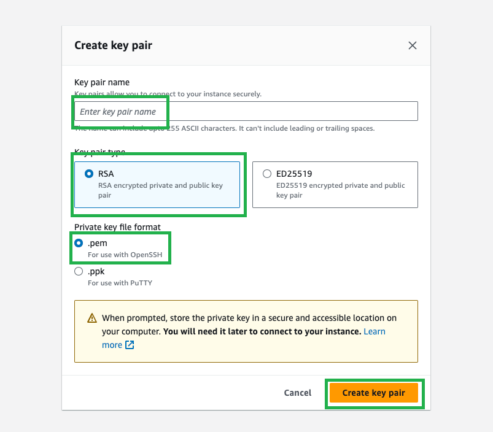

Creating and Connect to an EC2 Instance
===============

## Create a Windows EC2 Instance

Navigate to the EC2 service.

Select "launch instance" to create a new EC2 instance.

Most options here can be left as their defaults. Here are the ones that need selected/changing:

1. Select "Windows" from the Quick Start options.

    

2. We need to create a new key pair: Select "Create new key pair".

    

3. Enter a name for your key pair, leave the key pair type as ``RSA`` and the file format as ``.pem``. This will download a key file to you PC which you will use to connect to the instance.

    

The network should be in the same VPC as your cluster. Select create a new security group that allows connections from anywhere.
    - This is only for the purposes of the MVP. For customising see [this page](https://docs.aws.amazon.com/AWSEC2/latest/UserGuide/working-with-security-groups.html) on security groups.

## Adding your new security group to ???? // TODO ZAN

Once created - make sure to add the security group of your Managed kdb Insights cluster (Actions → Security → Change security groups and add search for the one from our cluster)

You should now have two security groups, one from the launch wizard, and the one you added manually that is also attached to your cluster (WTH???)

// TODO ZAN what is this?

## Connecting to your EC2 Instance

Open your EC2 Instance.

Select connect.

### Get your password

this only needs to be done once. Once you have this password you can skip this step.

Select get password.

Upload the ``.pem`` that was saved to you PC earlier (alternativly you can just paste the contents of this file in the text box).

This will return the value of your password. Keep a note of this password as you will need it to connect your EC2.

### Connect

Download the remote desktop file.

Run this file and enter the password you recieved above when promted. You should now be connected to the Windows remote desktop.