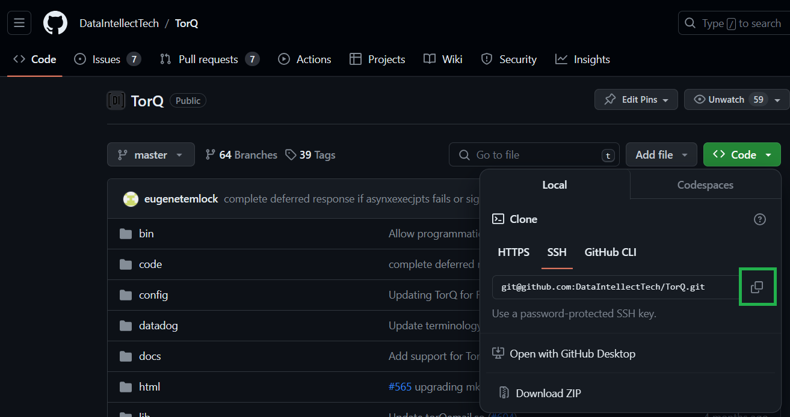
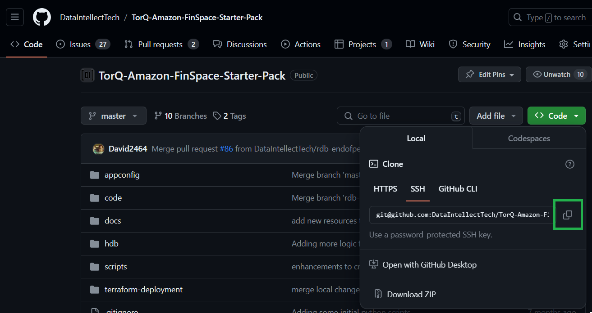

Prerequisites
===============

- An [AWS account with an AdministratorAccess policy](https://docs.aws.amazon.com/aws-managed-policy/latest/reference/AdministratorAccess.html) to create the Managed kdb resources.
- A KX insights license applied to our account. If you don’t have one see [Activate your Managed kdb Insights license - Amazon FinSpace](https://docs.aws.amazon.com/finspace/latest/userguide/kdb-licensing.html).
- Inside a Linux system you will need to download code from the [TorQ](https://github.com/DataIntellectTech/TorQ/tree/master) and [TorQ-Amazon-FinSpace-Starter-Pack](https://github.com/DataIntellectTech/TorQ-Amazon-FinSpace-Starter-Pack/tree/master) GitHub repositories - Instructions below.

This system will be referred to as your ‘local repository’ throughout this documentation.
- To clone each GitHub repository, please navigate to each respective repository and click the green code button.

## Downloading the Code

### TorQ

To clone this git repository, please navigate to [this repository](https://github.com/DataIntellectTech/TorQ/tree/master) and copy the ssh link as indicated in the below image.

Run the following command in your Linux system to download the code:

    git clone <your_copied_ssh_link>

### TorQ Amazon FinSpace Starter Pack

To clone this git repository, please navigate to [this repository](https://github.com/DataIntellectTech/TorQ-Amazon-FinSpace-Starter-Pack/tree/master) and copy the ssh link as indicated in the below image.

Run the following command in your Linux system to download the code:

    git clone <your_copied_ssh_link>

### Zip them up

Now we will zip these files together:

    zip -r code.zip TorQ/ TorQ-Amazon-FinSpace-Starter-Pack/

Then upload them to your AWS S3 codebucket:

    aws s3 cp code.zip s3://<you S3 codebucket name>